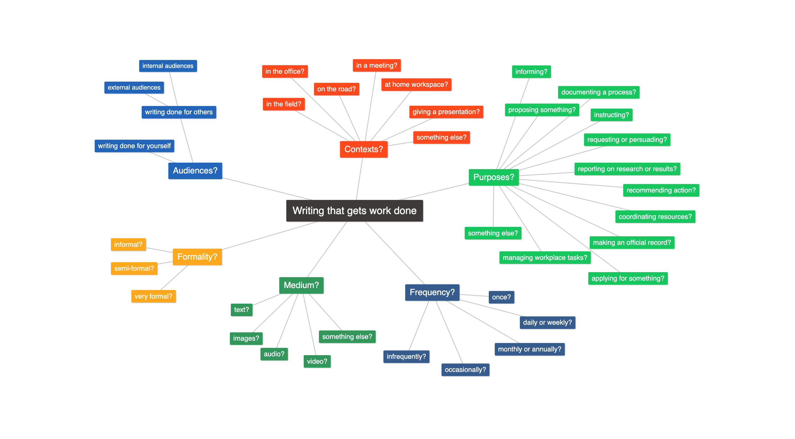

[ENGL 3301, Fall 2021](index.html)

# Project 1: Fact Sheet about Writing in Your Profession

**Background**

The major projects in this course are designed to introduce you to the kinds of writing typical in your discipline or intended profession. Here's the problem&mdash;though I'm an expert in technical communication, I am not an expert in every. single. field. out there. That's where YOU come in&mdash;to apply your own growing disciplinary content knowledge and build on that knowledge to make observations and draw conclusions about professional communication in your field.

Some of you are already working in or have experience in your fields, and this series of projects will serve as an opportunity for you to go deeper on what you've already been introduced to and to hone key writing and research skills. For others, these two projects will serve as an introduction or awakening to the realities of future writing at work and how it may resemble or differ from writing at school.

<mark>Read these instructions thoroughly: they set up the rhetorical problem you are going to solve for Project 1.</mark>

## Scenario

You are a new employee at your dream job. In a few weeks, the local community college is holding a job fair, and your employer has reserved a booth. The display table will have an assortment of the usual brochures and freebies: basic information about careers in that field, a "how to apply" handout, keychains or koozies and other swag, and an assortment of special topics brochures about important issues and trends in the profession.

Your boss is well known around the office for talking all the time about how important it is that the writing around the office really needs to be up to specs, and how that's always a surprise to new hires. She has also noticed that you've got some decent writing and design chops, so she has asked you to prepare a new handout to add to the usual set of brochures.

Your boss asks you to put together a fact sheet about writing on the job. She wants you to make clear to those college students (i.e. potential interns, graduates, and eventually new hires) that writing and communicating are important workplace skills and involve a variety of different audiences, situations, and tasks--something they'll need to keep working on and thinking about even after college. All of the other handouts are only single-pagers, so you've got the front and back of a single page (or maybe a trifold brochure) to get your message across. The document should also be appropriate for emailing to internship directors and colleges in the region. Finally, your doc should look professional and represent your employer well.

Create a **fact sheet** that will meet everyone's needs in the above scenario. (You can make up the details for your dream job.) This text should **present a bird's-eye overview of writing in your chosen profession to your unfamiliar, nontechnical audience**. Research to collect information about the types, or genres, of technical and professional communication that professionals in your profession create. Use the features and strategies of TPC that you're learning about to highlight connections and explain important ideas for your audience.

## Learning goals for this assignment:

Along with our basic course SLOs (1, 2, 3) our specific goals with this assignment are:

- Practice balancing clarity and concision as you try to describe content both completely and succinctly for an audience using text and visuals.
- Practice information and document design as you organize your findings in a way that suggests meaningful connections for an audience.
- Learn about characteristics of writing you will typically do in the workplace.
- Identify ethical issues relevant to writing in your field.
- Learn to use some intermediate features of your word processor software.

## Requirements

### Content Requirements

1. Your fact sheet needs to summarize key information about **at least 10 different kinds (genres) of TPC**, **specific readers and purposes for writing in that profession**, **distinctive features or characteristics of TPC in that profession**, and **ethical or social issues relevant to writers in that profession**.

2. Your fact sheet should have key messages or controlling ideas and not be a randomly organized assortment of statements.

2. Your fact sheet should include at least one relevant technical illustration or graphic. It must be conceptual or informational, not just decorative. You may include other decorative elements.

3. You may include other information you find relevant to the situation your fact sheet sheet is resolving.

4. Respect the intellectual property rights of others by citing and linking to sources, whether you use commons-based or copyright-protected content. Look at examples to see how other fact sheet writers have handled this.

### Design Requirements

An effective design will help readers use and understand your document and should suggest meaningful connections between bits of information.

- Use text structures (such as titles, subtitles, footnotes, and other elements) to clarify the audience, purpose, and scope of your text as well as present its content.
- Use design elements and graphics to highlight key information, reinforce relationships in your content, and make your fact sheet easy to read and visually appealing.
- Format your fact sheet so that it fits on no more than 2 pages in MS Word (i.e. it could be printed out front-to-back on a single piece of standard printer paper).
- Proofread your document; your work should be free from surface errors.
- *Do not turn in a document with double-spaced, 12pt Times New Roman manuscript formatting, a school-type heading, etc.*

# A few things to help you get started

## Researching writing in your profession

Research the kinds of writing individuals in your chosen career field do and come up with a list that is as comprehensive as possible. Your list will encompass all sorts of writing, from everyday to infrequent, from informal to formal. Don&#39;t overlook social media, as that has become an important venue for technical and professional writing in the 21st century. **Figure 1** is a mind map that you might find helpful in thinking through possible contexts, purposes, and other features for workplace writing.

<figure style="border:1px black solid; padding: 2%;">

<figcaption><i>Figure 1: What are audiences, purposes, contexts you might write for as a professional? Click to enlarge image. Mind map made with https://tobloef.com/text2mindmap/</i></figcaption>
</figure>

Your fact sheet should be the result of **research** , not generalizations you can come up with off the top of your head. You can locate information about writing and communication through a variety of activities:

- research in the university library (the library most likely has books about writing in your field)
- research on the Internet (check resources created by professional organizations in your field, government organizations and nonprofits, as well as [trade periodicals and websites](https://youtu.be/ODk6My5y1WA))
- research in academic databases and journals about professional writing in your specific profession
- interviews with working professionals
- reviewing your textbooks for examples and information
- examine field [style guides](https://en.wikipedia.org/wiki/Style_guide)

## Creating and designing your document

Create your fact sheet using MS Word. Word is free to TAMUCC students via [Office 365](http://it.tamucc.edu/Office365/Office365.html). I'm a big Google nerd, but for this assignment do not use Google Docs because formatting options are limited in those tools.

We will participate a series of peer review sessions using your university OneDrive account where you will get feedback from myself and your classmates that you can apply as you work.

## Looking at examples of fact sheets

The list below includes fact sheets from a variety of sources, including professional organizations, government websites, and nonprofit organizations. Use these as inspirations and models, but strive to make your document **your own**. Rather than make something that is mostly a copy of one of the examples, be creative as you apply concepts we've discussed related to helpful designs, usable illustrations, and readable prose.

 - [American Association of Colleges of Nursing (AACN) fact sheets](https://www.aacnnursing.org/News-Information/Fact-Sheets)
 - [American Occupational Therapy Association (AOTA) fact sheets](https://www.aota.org/About-Occupational-Therapy/Professionals/Master-List.aspx)
 - [Occupational Safety and Health Admiinistration (OSHA) fact sheets](https://www.osha.gov/pls/publications/publication.AthruZ?pType=Types&pID=2)
 - [International Dyslexia Association fact sheets](https://dyslexiaida.org/fact-sheets/)
 - [Department of Homeland Security (DHS) fact sheets](https://www.dhs.gov/news-releases/fact-sheets)
 - [NAACP Criminal Justice fact sheet](https://www.naacp.org/criminal-justice-fact-sheet/)
 - [Sentencing Project fact sheets](https://www.sentencingproject.org/criminal-justice-facts/)
 - [Health.gov Move Your Way campaign fact sheets](https://health.gov/our-work/physical-activity/move-your-way-campaign#factsheets) - great examples for varying audiences!
 - [CDC Hand washing fact sheets](https://www.cdc.gov/handwashing/fact-sheets.html)
 - [US Department of Health and Human Services, Office on Women's Health fact sheets](https://www.womenshealth.gov/patient-materials/resource/fact-sheets)
 - [WHO index to fact sheets](https://www.who.int/news-room/fact-sheets)
 - [WHO violence and disasters fact sheet](https://www.who.int/violence_injury_prevention/publications/violence/violence_disasters.pdf?ua=1)
 - [CDC Coronavirus fact sheet](https://www.cdc.gov/coronavirus/2019-ncov/downloads/2019-ncov-factsheet.pdf)
 - [Census.gov fact sheets](https://www.census.gov/library/fact-sheets.html)

Writers of all abilities and experience levels can benefit from appointments with a Writing Consultant in the <a href="http://casa.tamucc.edu/wc.php" >CASA Writing Center</a>. Formatting, spelling, and grammatical errors can make your documents difficult to read and understand or can undermine your content.

[1] This project started life adapted from [a similar assignment by Traci Gardner](http://3764s16.tracigardner.com/assignments/project-2-analysis-of-writing-in-your-field-2/), though it's changed a lot since then. This project description is licensed under a Creative Commons license.

 This work is licensed under a <a rel="license" href="http://creativecommons.org/licenses/by-nc-sa/4.0/">Creative Commons Attribution-NonCommercial-ShareAlike 4.0 International License</a>.
