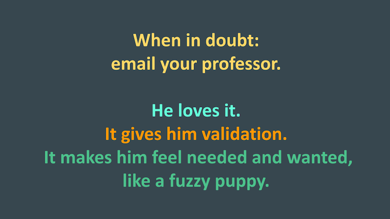

[ENGL 3301, Spring 2021](index.html)

# Project 2: Report on TPW

Below is my video overview for the project, but you must still **read this page completely**.

<iframe width="560" height="315" src="https://www.youtube.com/embed/eoQWvg3wEf8" title="YouTube video player" frameborder="0" allow="accelerometer; autoplay; clipboard-write; encrypted-media; gyroscope; picture-in-picture" allowfullscreen></iframe>

We started out this semester by asking the question, “What is technical and professional writing?” In your first project, you started to answer this question by surveying and examining the types of writing that actually happen in your prospective fields and professions. Put differently, project one was all about naming the various kinds of writing in your field. However, it’s important for us as writers to move beyond simply *being aware* of the kinds of writing we are likely to encounter as we continue to develop as professionals-who-write; we also need to *understand how to produce technical documentation that is effective*, and we need to have at least a working understanding of *why some writing is effective and others are not*. In other words, in order to become producers of effective technical documentation we need to be able to answer the following questions: **What makes technical writing good in my field? And what do I, as a professional-who-writes, have to do in order to produce it?** These two questions are the driving force behind writing project two.

Importantly, those two questions aren't only relevant to the workplace. As we've talked about throughout the semester, *technical communication is everywhere*, and is sponsored by individuals and communities outside of official organizations just as much as it is sponsored by workplaces and institutions. With that in mind, **you have **two directions you can choose from for this project**:
1. Do a "deep dive" on three professional genres that you feel are particularly pertinent for your field or professional goals.
2. Do a "deep dive" on user-created technical communication related to a non-work activity you participate in or are interested in.

The end result for either option will be similar: you'll write a report on your research findings, translating the primary and secondary research you'll do into a coherent set of claims about what constitutes "good" technical writing. You'll also need to address things that writers must do in order to produce effective technical documentation in the context you've identified, whether it's a workplace, a profession, or a hobbyist subreddit.

You might think of your audience for this report in a couple of ways, and any one of these will be a good audience for your report:
 - Other folx in your major. That is, write your report directed at people who are staring down a future in the career. What's important for them to know as professionals-who-will-write, and what is the secret recipe for understanding the documents and situations you've studied? How might your report serve their needs?
 - Your nerdy tech comm professor. That is, write your report directed at me, a person who is interested in writing and communication research. What will I find interesting about what you've studied, and what sorts of questions does your line of inquiry answer that I am interested in? How might your report serve my needs?
 - Someone else who needs to know what you're finding so they can use it to do something. That is, think about *who else* might find your research interesting and useful. What sorts of questions are they interested in answering, what sorts of problems are they interested in solving, and what kinds of actions might they take with your research findings? *Who needs* this information, and how might your report serve their needs?

## Option 1: Deep Dive on three professional genres
This option picks up where we left off with project 1. Choose three (3) types of technical writing that you identified in your fact sheets and that you feel are particularly pertinent for your field or professional goals. There is no set criteria for which three documents you should choose; however, *you must be able to provide a justification or rationale for why* you selected the three genres you did. (e.g. You might argue that you selected the genres that you did because they are the most common in your field, or perhaps they are the genres that carry the most professional capital, etc).

After selecting three (3) genres that will provide the focus of your project two research, you will then need to **locate actual examples of this type of writing from your field**. These need to be **real documents**, not hypotheticals or template forms that you pull off the internet.

As well as locating three documents, you must also conduct research (both primary and secondary) into *what makes these documents effective*. You have many points of entry into your research here since, as part of project one, you’ve already started to identify the rhetorical aspects of professional writing in your field. Project 2 is an opportunity to go into more depth and detail and examine not just what these elements are but how they function to create effective documentation. Your research should reference our course readings. You should also rely on [Chapter Five: "Writing in Genres"](https://scholarworks.uark.edu/oer/4/) in Adam Pope's *Open Technical Writing* textbook. In addition, you will need to conduct independent research (from academic and professional journals) to supplement and extend our course materials. Remember, you are researching what makes this piece of technical communication good and what technical writers have to do in order to produce it.

You will <mark>coalesce your research into a report that makes a series of claims about what constitutes “good” technical writing in your field and how writers produce it</mark>

## Option 2: Deep Dive on TC outside the workplace
In this option you will explore technical communication "as a broad human activity used to effect change in the world" (Kimball 2017, p 347). For this option, you will explore technical communication created **voluntarily by users** (what Kimball calls *tactical technical communication*) instead of technical communication that is motivated by institutions (Kimball's *strategic technical communication*), with the goal of understanding the ways people use and create technical communication in their everyday lives.

Think about the various activities you do, personal hobbies you have, or things that you're just kind of nerdy about: cooking, fishing, gardening, parenting, woodworking, Skyrim, motorcycle repair, low-impact camping, or a whole host of activist and advocacy activities. After you've decided on the activity you're going to explore, you will need to **locate three (or more) [user-created documents](weekly/tactical-tech-comm) centered around that activity**. (For example, since I own a Shopsmith woodworking system, I might use the Shopsmith subreddit, an online discussion forum, and this user-written "Buying a used Shopsmith" manual. But I would *not* use the official Shopsmith manual or offical Shopsmith Facebook page.)

As well as locating three documents, you must also conduct research (both primary and secondary) into *what makes these documents effective*. There is tons of research out there about user-generated technical communication, about the various technologies that are used in creating it, and the kinds of communities that use it. Your research should reference our course readings. You should also rely on [Miles Kimball's 2017 article "The Golden Age of Technical Communication" (JTWC 47.3)](https://journals.sagepub.com/doi/10.1177/0047281616641927) as a jumping-off point. *You'll mostly want to focus on his discussions of _tactical technical communication_. In addition, you will need to conduct independent research (from academic and professional journals) to supplement and extend our course materials. Remember you are researching what makes these kinds of writing technical communication and what makes them good, useful, or interesting.

You will <mark>coalesce your research into a report that makes a series of claims about what makes this stuff technical communication, what interesting features typify it, and even what possibilities it presents for technical communicators inside and outside the workplace</mark>.

## Requirements (same for both options)

- Adopt a report format that applies strategies for accessible, rhetorical, readable, and ethical technical writing. You could use a memo format or create a formal report with a cover sheet, or you might approximate some other relevant genre.
  - Use a writing style appropriate to your audience, purpose, and rhetorical situation
  - Include headings and subheadings to make your document more accessible and your key messages comprehensible.
  - Include visuals, figures, or illustrations in your document that will help readers understand your message
  - Incorporate design elements to highlight key information, reinforce relationships in your content, and make your document easy to read and visually appealing.
  - **Do not do not do not** turn in a document with double-spaced, 12pt Times New Roman manuscript formatting and a school-type heading.

- Rely on a mixture of primary and secondary research sources, including at minimum:
  - The 3 examples of TC you have selected
  - Our course readings
  - No fewer than 3 [articles from academic and professional journals](weekly/academic-journals) from your independent research

- Attend to writing and revision process through multiple drafts
- Adhere to APA, MLA, or another appropriate style guide requirements for in-text source integration and documentation (I don't care which guide you use, as long as you follow its requirements)
- Aim for 1500-2500 words long

Writers of all abilities and experience levels can benefit from appointments with a Writing Consultant in the <a href="http://casa.tamucc.edu/wc.php" >CASA Writing Center</a>. Formatting, spelling, and grammatical errors can make your documents difficult to read and understand or can undermine your content.

