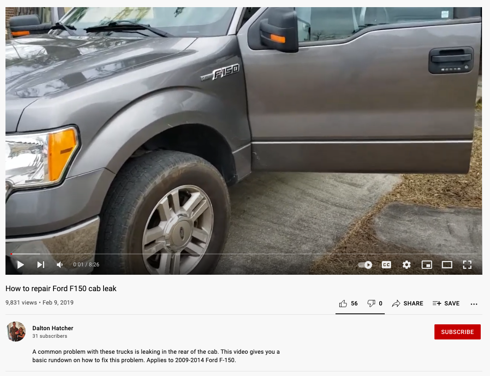

[ENGL 3301, Fall 2021](../calendar.html)

# Introduction to Tactical Technical Communication

In ["The Golden Age of Technical Communication" (2017)](https://journals.sagepub.com/doi/10.1177/0047281616641927) Miles Kimball (a tech comm professor at Rennsaeler Polytechnical) describes the general historical movement in the profession of technical communication from **strategic technical communication** to **tactical technical communication**. His concern in the article is getting a sense of the "vast, underrecognized landscape of technical communication as enacted by nearly everyone in the world who communicates about or through technology" (2017, p. 346). He's also interested in the implications of what he calls today's "Golden Age of Technical Communication" for academic programs and the discipline of technical communication--i.e. those people who have job titles like "technical writer" or "technical communicator." What does a "broader view" of technical communication mean for working technical communicators?

A radical simplification of his historical overview is that tech comm has developed slowly over time into a distinct profession growing out of engineering, defense technology, and computer industries. In that traditional sense, technical communicators are people who are paid by companies to do their technical communicating. They create *strategic technical communication* for those companies and institutions.

But now that much of the world's population has networked computers with which they can create their own documentation, they are creating technical communication every day, just because they want to, and without getting paid for it. That is the domain of *tactical technical communication*. Today, "many people have grown so adept at using technologies that they do not use or need corporate-designed technical documentation; instead, they make technical documentation themselves to share with other users" (p. 340). We have started look beyond corporations for help, instead turning to other people, just like us, who use and modify and tinker with technology.

## Strategic technical communication: created by institutions, for users
Strategic technical communication is "official" or institutionally-motivated technical communication, and has the following qualities:
- occurs inside formal organizations and traditional institutional contexts
- **professional**: created by specialist producers from knowledge derived from education and subject matter experts (someone's getting paid)
- **invisible**: or "typically visible only in the context of failure" (p. 343) (i.e. you don't read the manual until the thing isn't working; i.e. you don't realize how much technical communication is all around you everyday.)
- **user-centered**: focused on needs of the user, but ultimately in order to "sell products, to avoid liability, and to foster customer loyalty" (p. 344). User-centeredness is a means to an end.
- **anonymous**: most commonly, the corporation is the author in that they put their name on and are responsible for the discourse, and the name of the individuals that created it likely do not appear on the document
- **controlled**: highly controlled by the institution and corporation, typified by high-quality output but may lack authenticity
- *Examples*: The product manual that comes with your new phone. An annual report for a company or organization. Pamphlets on breastfeeding from La Leche League international. A treatment plan from your doctor. Reports, proposals, and correspondence you write as part of your job. A company or institution's website and social media presence. Washer/dryer maintenance videos on YouTube from PartSelect.com. Official marketing for a popular video game or movie.

## Tactical technical communication: created by users, for users
Tactical technical communication is "unofficial" or user-motivated or community-motivated technical communication, and has the following qualities:
- occurs outside formal organizations and traditional institutional contexts
- **amateur**, created by user-producers from knowledge derived from their experience (ain't nobody getting paid)
- **visible**, "a voluntary contribution to public discourse. It typically puts itself out there and hopes to be heard--perhaps to to entertain, as well as instruct" (p. 343)
- **user-created**: created by users for users based in their own experience, not by companies for users in a vaguely paternalistic or marketing sense
- **personal** and authored with pride in the sense of the individual author getting credit/reputation/kudos for their contributions; may be anonymous depending on the goals of the communication/author
- **authentic**: not controlled by corporations and institutions, makes up for potential low quality with authenticity
- *Examples*: Unofficial discussion forums for a product. Reddit explanations. Online breastfeeding forums (or cat leukemia forums, or psychiatry forums, or diabetes forums). Hacktivist guides. DIY hormone replacement therapy manuals. Washer/dryer maintenance videos by some random dude on YouTube. Fan-created marketing for a popular video game or movie.

Tactical technical communication occurs between and outside of institutions and corporations. Occasionally, corporations will in fact attempt to leverage or co-opt the expertise of user communities by creating sponsored online forums or inviting user-generated content. But often tactical tech comm happens outside instiutions--even despite them and against them in many cases, especially in the case of online health communities, where users feel overlooked, forgotten, or ignored by medical experts and turn to communal expertise for help in navigating the complexities of their conditions.

The table below (Table 1) provides examples of strategic and tactical technical communication, showing basically the same forms and genres of TC in strategic contexts versus tactical contexts:

_Table 1: Examples of Strategic and Tactical Tech Comm_

| Strategic Technical Communication      | Tactical Technical Communication            |
|----------------------------------------|---------------------------------------------|
| [Shopsmith company and product website](https://www.shopsmith.com/aboutus.htm)  | [Shopsmith Forums](https://forum.shopsmith.com/viewtopic.php?f=7&t=24801%5B/url) |
| [Shopsmith product manuals](https://www.shopsmith.com/ownersite/productmanuals.htm) | User-created manuals ([example 1](https://forum.shopsmith.com/viewtopic.php?f=10&t=16113), [example 2](https://forum.shopsmith.com/download/file.php?id=36583)) |
| [Shopsmith Academy tutorials and videos](http://www.shopsmithacademy.com) | Tutorial videos on [YouTube](https://www.youtube.com/watch?v=lcvWJukgUF4&t=3s) or [Reddit](https://www.reddit.com/r/shopsmith/comments/lcvb1h/aligning_the_shopsmith_table/) |
| [Shopsmith's Facebook page](https://www.facebook.com/Shopsmith) | [Shopsmith owners Facebook group](https://www.facebook.com/groups/684461538311971) |
|                                        |                                             |

### Some questions to ask yourself as you read these notes and reflect on the Kimball article:
- Why has there been such an explosion of technical communication—of tactical technical communication?
- Why is tactical tech comm worth our time to analyze and learn about?  
- What communication strategies are common between the two, and what communication strategies are distinctive?
- What does tactical tech comm offer that strategic tech comm does not? And vice versa?
- What risks does tactical tech comm invite that strategic tech comm does not?
- How do corporations, companies, businesses, organizations make use of tactical technical communication for their own ends? Are there ethical problems involved in that?

## A closer look at one example of tactical tech comm: UncleRusty's YT video
These following sections provide more detail and examples of key characteristics of tactical technical communication (TTC). I’ll talk about an example of TTC throughout: a YouTube video by UncleRusty, “How to repair Ford F150 cab leak” (https://youtu.be/Uy3-cj2MFnc). In its rough way (Figure 1), it’s a very good example of TTC and will be useful to help think about what makes this kind of tech comm tick. You don’t have to watch the entire video unless you want to (it’s about 8 minutes long), and I’ve provided timestamps for the moments I talk about in the video.  

 <figure><figcaption><i>Figure 1: The poorly framed opening shot of the “How to repair Ford F150 cab leak” video</i></figcaption></figure>

### “All of ‘em friggin leak”: Still technical communication, but kinda different.

First, you should remember that both tactical TC and strategic TC are still technical communication. They do the same things, and a lot of times in some of the same ways, but there are some key distinctions to keep in mind for our own technical and professional communication practice. The names “tactical/strategic” can get in the way; you could just as well refer to them as “amateur/professional” or “user-created/corporate-created” if it helps you to be clear. The following table (Table 2) is a refresher of the key qualities of each kind. As I’ll say again later, the qualities are a bit “leaky” in that they are connected with each other in ways that can sometimes make it difficult to draw clear lines between them. But we can handle leaky concepts, right?

Table 2: Qualities of tactical and strategic technical communication. Based on Kimball, 2017.

| Tactical (extra-institutional, amateur) | Strategic (institutional, professional) |
| --- | --- |
| User-Created | User-Centered |
| Visible | Invisible |
| Personal | Anonymous (Corporate) |
| Authentic | Controlled |

The second set of concepts we need to hang on to is Cassandra Race's six characteristics of technical communication. As you'll remember, technical and professional communication is:
- focused on audience,
- rhetorical, persuasive, purposeful, and problem-oriented
- professional
- design centered
- research and technology oriented
- ethical

#### Technical communication translates specialized knowledge to audiences who need it
Either because he’s a mechanic or because he’s researched the problem on the internet, he knows that the problem is common and knows the usual diagnosis. He’s got expert knowledge that he’s sharing with viewers. For instance: “What a lot of times people run into is this third brake light here…” (0.19). And throughout, he’s translating; here’s one simply-worded explanation: “the [gasket] on the factory housing is really thin, and it, it shrinks over time and it allows water in, so you’ll end up with stains on your headliner” (0.30).

Jargon sneaks in from time to time, without explanation: “I tried to RTV the factory housing” 0.55). Here he uses an initialism (similar to an acronym) as a verb: RTV is room-temperature-vulcanizing silicone, a specialized sealant in the automotive industry. He uses jargon in that very specific way that technicians talk to other technicians so they can quickly and easily understand. Outsiders would have to look up RTV and figure it out, as I did. (So, not a perfect moment in technical communication right there.)

#### Technical communication is purposeful and problem-oriented and addresses a specific audience
This video helps viewers solve specific problems. The author uses a classic technical communication technique to make the purpose and audience clear: he opens with a BLUF-style summary of what the piece of tech comm is about and what purposes it supports:  “So, this is gonna be a video on uh, how to fix a leaky F-150, cuz there’s not a whole lotta <grunts while climbing tailgate> literature on the internet <grunt> about this type of thing, so...” (0:00-0:19)

The purpose is also provided in the video title and description—all places where subject and key message are briefly summarized to help viewers decide whether or not this content is relevant and useful for them. The video closes with a similar recap: “Um, yeah, so that’s that’s that’s basically a quick rundown of… how to reseal your back window on a 12th generation F150, that’s 2009 to 2014…. I don’t know, I don’t know what the other generations, uh what the procedure would be for the other generations but that’s what it for this so… like, subscribe. If you want more how-to videos, let me know. Peace”  (7:50-end)

At the same time it doesn’t follow the “rules” for manuals. For instance, the video doesn’t really show us what “the problem is” until about 7:00. Seven minutes in to an eight-and-a-half minute video. He explains the real problem at the end, rather than at the beginning, which is where we might expect it to be in a traditional manual. (Here’s your problem, here’s the cause, here’s how to repair it.) He’s free of the genre constraints of the traditional manual, but we can also see how following some of those might make the video more helpful. He’s also free of the corporate purposes for the manual, like protecting the bottom line, protecting the company from legal liability if something goes wrong, and ensuring customers use a product in the way it’s intended.

#### Technical communication is design-centered
With its emphasis on close-up first-person, hand-in-the-foreground views of everything, the video is design-centered in that the design is appropriate for the task. At the same time, this is not a professionally shot video: the camera jiggles and moves and wanders.

#### Technical communication is research and technology-oriented
While it’s oriented around technology (it’s a vehicle repair video), the “research” being shared here is different. It’s the expert knowledge of someone who just completed the task and is going to share what they did and why they did it that way. Rather than the mechanisms of peer review, editorial experts, and research scientists, it’s the creator’s experience and the validity of “see I’m showing you what I did.” UncleRusty shows us he’s credible through different means than more “professional” sources might. His epistemology and expertise are rooted in experience instead of abstract knowledge.

#### Technical communication is professional (?) and ethical
The key distinction between tactical and strategic technical communication, the one that everything else kind of falls around, is the Amateur/Professional distinction. Tactical tech comm is made by amateurs, by users, while Professional tech comm is corporate. One of Race’s major characteristics of TC is professionalism, and that’s where things start to break down. She defines professional as reflecting “the values, goals, and culture of the organization”: we often tie professionalism to things “looking professional” or “sounding professional”. Certain markers of speech and dress (or spelling and document design) that sound and look professional. Other kinds of language are “vulgar” or “amateur.” We’ll come back to this idea of professionalism more throughout the semester, but it’s important to remember now that professionalism is not some abstract, essentialist quality that we can all meet. It’s culturally bound and socially determined, and it can change. (And sometimes should change.)  

But to this video: Uncle Rusty (not Mr. Lastname) has filthy fingernails. He’s just some guy that grunts and pauses and rewinds as he talks; he curses and criticizes the big companies. You can see his rusted-out second truck in the driveway and a gallon of water in the front seat. This is not a professional set up. He is representing himself, not an organization. The video is personal, which is doing some of the same things as professional, but in different ways.

That ties in to the *ethos* or ethical stance of the video as well: again, he’s representing himself, not a business or company, so he is free not only to provide “alternative” solutions and workarounds to standardized problems that might not appear in the legally liable repair manual, but also to criticize the companies that make the products he’s repairing. His ethical obligation here is mostly to himself and to the community of viewers he is interacting with and responding to. He also wants to provide accurate, honest information, and it’s all framed through that “what I did was” ethos of the DIY repair video. This has a lot to do with the “personal/anonymous” distinction that leads off the next section.

### Key characteristics of tactical technical communication (TTC)

As you’ll start to see almost immediately, a LOT of these qualities are deeply intertwined with each other, but they provide focal points for understanding HOW a piece of technical communication is doing what it’s doing.

#### TTC is personal and visible, not anonymous and invisible
The video closes with the classic YouTube outro: “like, subscribe.”  The author is aware (if a little ironic about) the genre conventions of the YouTube channel. The social mechanisms of liking and sharing are ubiquitous today, but important for ensuring that voluntary contributions are not only published but distributed: he depends on his audience to help amplify the video in a world swimming in YouTube Content. And then he invites interactions with his audience: “If you want more how-to videos, let me know. Peace.” This is both personal (contact me) and visible (I’ll get you more of what you want to know). Even though we never see “UncleRusty” he is also not the absent, faceless writers of the Chilton or Haynes repair manuals.

Again, go back to the section about “Technical communication is professional (?) and ethical” to see comments about personal versus professional.

#### TTC is authentic, not controlled
This video is authentic in that it is not professionally produced and not at all controlled in a corporate sense. It’s wobbly and we can tell it’s shot on the speaker’s phone camera as he walks around his truck and garage. UncleRusty has grubby fingernails, signaling that he has just finished the repair before walking us through it. He’s a real, regular guy in his driveway at home. The video is peppered with “uhs” and “I dunno if you can see that,” and he grunts and curses as he makes his way around the driveway. And his YouTube profile picture is an informal family picture, not a professional headshot.

This video fits the classical technical writing genre of step-by-step instructions, but rather than the cut-and-dried explanations we see in official repair manuals and product guides, this author very conversationally inserts tips about how to complete complex steps or other kinds of asides that again play into the authenticity of the video. it’s not that the author is trying to be authentic by doing these things: he’s just doing them. It’s all just (we guess) who he really is. Some examples of different kinds of authenticity:

- “Just reach up under the headliner with your hand and pull those down” (4.20) instead of a more plain version that might appear in a manual, he tells us casually to use our hands to pop the plastic covers off.

- Procedural advice is framed as “what I did was…” rather than “how it should be done officially.” For example, when he details first using a putty knife to loosen the window, then switching to a flathead screwdriver to pry open the window seal (4.56). The manual probably does not encourage repair techs to use a flathead screwdrived to pry the rear window out of its seating.

- Then the author takes off on a tangent to describe the properties of butyl tape, “some pretty nasty shit” (5.25).  Note the “authentic” language there. J In a manual, not only would there not be cursing, but the butyl tape would likely have been listed up front in a parts list. He then tells a little story about trying to get the best price for the tape—and clearly thinks Ford is overcharging.  

- He includes variety of little interpretive injections that you don’t see in a professional manual, statements that evaluate the complexity of certain such as “that’s not a big deal” (3.58).

- Before he closes, the author criticizes the craftsmanship of Ford (7:36) and then goes on to briefly argue that there should be a class-action lawsuit about this common problem: “all of ‘em friggin leak.” A repair manual like Chilton’s would NEVER criticize Ford in their manuals—they don’t want to get sued themselves!

## Finally, Some Studies of Tactical Technical Communication in TCR journals if you're really feeling nerdtastic

Beale, M., McKittrick, M., & Richards, D. (2016). “Good” Grief: Subversion, Praxis, and the Unmasked Ethics of Griefing Guides. *Technical Communication Quarterly, 25*(3), 191–201. https://doi.org/10.1080/10572252.2016.1185160  (explores Minecraft griefing guides published in online forums)

Colton, J. S., Holmes, S., & Walwema, J. (2017). From NoobGuides to #OpKKK: Ethics of Anonymous’ Tactical Technical Communication. *Technical Communication Quarterly, 26*(1), 59–75. https://doi.org/10.1080/10572252.2016.1257743 (examines technical documents produced by hacktivist group Anonymous)

deWinter, J. (2014). Just playing around: From procedural manuals to in-game training. *Computer games and technical communication: Critical methods and applications at the intersection*, 69-85. (examines user-created video game instructions)

Diehl, A., Grabill, J. T., Hart-Davidson, W., & Iyer, V. (2008). Grassroots: Supporting the Knowledge Work of Everyday Life. *Technical Communication Quarterly, 17*(4), 413–434. https://doi.org/10.1080/10572250802324937 (discusses the nature of knowledge work in everyday life)

Ding, H. (2009). Rhetorics of Alternative Media in an Emerging Epidemic: SARS, Censorship, and Extra-Institutional Risk Communication. *Technical Communication Quarterly, 18*(4), 327–350. https://doi.org/10.1080/10572250903149548 (examines how professionals and the public employed alternative media to participate in unofficial risk communication during the 2002 SARS outbreak in China.)

Edenfield, A. C., Holmes, S., & Colton, J. S. (2019). Queering Tactical Technical Communication: DIY HRT. *Technical Communication Quarterly, 28*(3), 177–191. https://doi.org/10.1080/10572252.2019.1607906 (examines user-generated instruction sets providing direction on the self-administration of hormone therapy)

<mark>Ferro, T., & Zachry, M. (2014). Technical Communication Unbound: Knowledge Work, Social Media, and Emergent Communicative Practices. *Technical Communication Quarterly, 23*(1), 6–21. https://doi.org/10.1080/10572252.2014.850843 (reports on how knowledge workers use publicly available online services to support their work)</mark>

Grabill, J. T., & Pigg, S. (2012). Messy Rhetoric: Identity Performance as Rhetorical Agency in Online Public Forums. *Rhetoric Society Quarterly, 42*(2), 99–119.  (examines how users establish identity in public science forums)

Ittersum, D. V. (2014). Craft and Narrative in DIY Instructions. *Technical Communication Quarterly, 23*(3), 227–246. https://doi.org/10.1080/10572252.2013.798466 (examines tutorials from the Web site, Instructables.com, to highlight the rhetorical possibilities of including personal narratives in instructions)

Kimball, M. A. (2006). Cars, Culture, and Tactical Technical Communication. *Technical Communication Quarterly, 15*(1), 67–86. https://doi.org/10.1207/s15427625tcq1501_6 (defines tactical technical communication, examines two cases of technical documentation occurring outside of institutions)

<mark>Kimball, M. A. (2017). The Golden Age of Technical Communication. *Journal of Technical Writing and Communication, 47*(3), 330–358. https://doi.org/10.1177/0047281616641927 (defines tactical technical communication, uses a historical perspective to describe the development of the profession of technical communication through three ages: Brass, Beige, and Glass. Describes today as the Golden Age)</mark>

Mackiewicz, J. (2010). The Co-construction of Credibility in Online Product Reviews. *Technical Communication Quarterly, 19*(4), 403–426. https://doi.org/10.1080/10572252.2010.502091 (analyze examples of reviews of digital cameras to examine how reviewers of a technical product convey credibility and how review readers coconstruct reviewers' credibility)

Mackiewicz, J. (2014). Motivating Quality: The Impact of Amateur Editors’ Suggestions on User-Generated Content at Epinions.com. *Journal of Business and Technical Communication, 28*(4), 419–446. https://doi.org/10.1177/1050651914535930 (examines the type of edit that amateur editors called Advisors used in their comments on Epinions.com product reviews and the extent to which their editing-related comments might have motivated reviewers to revise and update their reviews)

McCaughey, J. (2021). The Rhetoric of Online Exclusive Pumping Communities: Tactical Technical Communication as Eschewing Judgment. *Technical Communication Quarterly, 30*(1), 34–47. https://doi.org/10.1080/10572252.2020.1823485 (argues that exclusive pumping forums are sites of tactical technical communication – operating as “anti-institutional” – and explores these forums as places of inspiration and support, as well as spaces where mothers seek to solve technical feeding problems while avoiding institutional judgment)

<mark>Pflugfelder, E. H. (2017). Reddit’s “Explain Like I’m Five”: Technical Descriptions in the Wild. *Technical Communication Quarterly, 26*(1), 25–41. https://doi.org/10.1080/10572252.2016.1257741 (examines technical descriptions on the Reddit message board “Explain Like I’m Five,” in which answers to complex questions are crowdsourced)</mark>

<mark>Verzosa Hurley, E., & Kimme Hea, A. C. (2014). The Rhetoric of Reach: Preparing Students for Technical Communication in the Age of Social Media. *Technical Communication Quarterly, 23*(1), 55–68. https://doi.org/10.1080/10572252.2014.850854 (defines reach and crowdsourcing)</mark>
