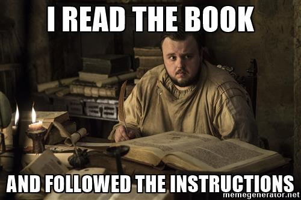
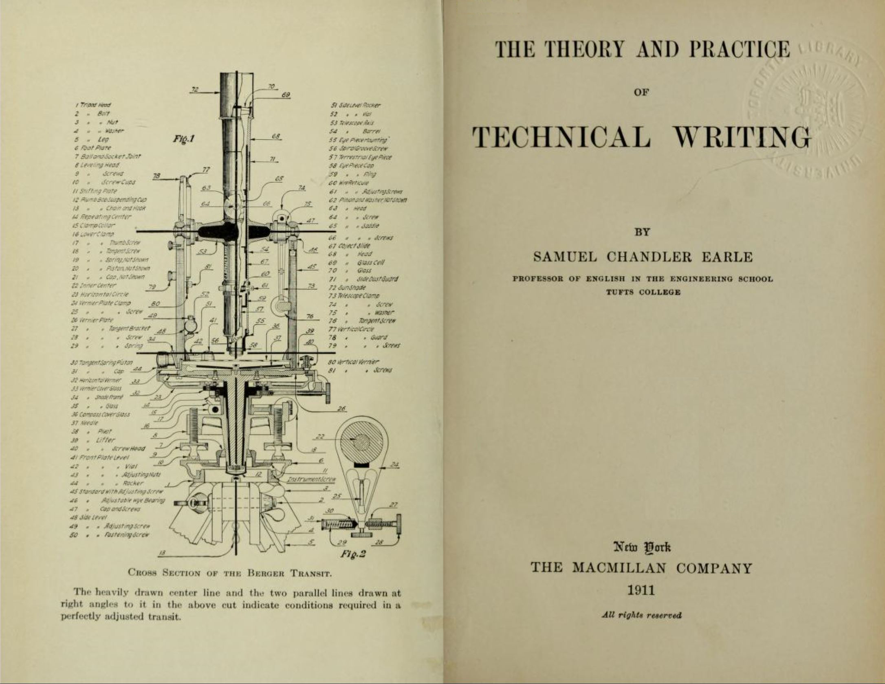
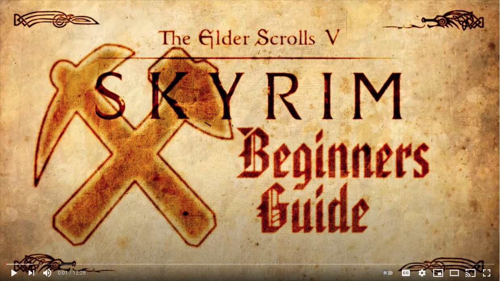

# Notes and Overview for Week 01
[ENGL 3301, Fall 2021](../calendar.html)

*Important: No assignments or course documents, including the syllabus, should be considered to be in their final form until the first week of class begins.*

Each week, I'll provide you notes and an overview of the week's content (just like this document). These docs will detail specific readings, assignments, and due dates for each week. In general, when people email me about being confused about what to do that week, I will ask them: "Did you check the overview?" Always check these weekly documents first!

<figure>
<figcaption><i>Figure 1: Always read the instructions</i></figcaption>
</figure>

I have structured coursework around a Tuesday/Thursday schedule, so you will see assignments and readings broken up into two days each week. To read more about how and why the course is scheduled the way it is, please review the "Course Conduct" section of our syllabus.

If you find something in error, or are confused about any part of the instructions, please email me at [christopher.andrews@tamucc.edu](mailto:christopher.andrews@tamucc.edu). If your question is one that the entire class will benefit from hearing, I will likely share the answer with everyone!

## We have a few things to do during the first week:

- Clarify the nature of and goals for the course
- Get situated for online learning
- Get to know each other a bit
- Get started thinking about technical and professional writing and how it's different from other kinds of writing

Before you dig into any of this week's assignments, be sure that you have:

 1. Located and carefully read our [course syllabus](http://cdmandrews.github.io/3301/index.html).
 2. Reviewed the [course introduction slideshow](https://docs.google.com/presentation/d/e/2PACX-1vReXq7B9dYlJRqfha537G4AjTzi6pUuAxG2Zlni8YNViiXNkPj0M13nPXkWRnjvnZMJv1T5eMjvXfoo/pub?start=false&loop=false&delayms=3000)
 2. Viewed the [course orientation video](https://youtu.be/D6NADNhfLdU) and explored our Blackboard course shell. Can you locate:
   - your group area and discussion forums?
   - weekly folders?
   - major project descriptions?
   - information about contacting your winsome professor?
   - policies for late work and other issues that commonly come up in a semester?
 2. Uploaded a profile picture to Blackboard. If you need instructions, visit [Creating your Blackboard Profile](https://en-us.help.blackboard.com/Learn/9.1_Older_Versions/9.1_2014_and_2015/Student/030_Nav_My_Blackboard/Profiles).

## Week 01 Welcome video
<iframe width="560" height="315" src="https://www.youtube.com/embed/L8TPKP_8itQ" frameborder="0" allow="accelerometer; autoplay; clipboard-write; encrypted-media; gyroscope; picture-in-picture" allowfullscreen></iframe>
<i>A short welcome from me, your professor.</i>

## Okay, let's start with "Technical Writing" (Whatever that is)
(This article contains material adapted from https://www.prismnet.com/~hcexres/textbook/intro.htm)

Technical and professional writing (TPW) courses introduce you to some of the most important aspects of writing in the worlds of science, technology, and business&mdash;in other words, _the kind of writing that scientists, nurses, doctors, computer specialists, government officials, engineers, and so many other kinds of people do as a part of their regular work_.

>Quick sales pitch: As well as this introductory course, TAMU-CC also has a [TPW minor](https://catalog.tamucc.edu/preview_program.php?catoid=13&poid=1186), a Writing for NonProfits certificate, and a Technical Communication BAS Track. With practice in a variety of genres, modes, techniques, and emphasis on tons of communication skills, the TPW Minor is an excellent accompaniment to any course of study.

One thing you'll hear me say a lot is that TPW is all about **using writing to do something**. It's not there for the sake of itself or for entertainment&mdash;TPW has a purpose and an audience and those people **need** your writing to get their work done.

To learn how to write effectively for the world of work, in this class you'll study common situations for and and genres of writing in your future career. You'll practice special format items such as lists and headings, techniques for putting graphics into your work, and some techniques for producing professional-looking documents. And you'll research writing in your field by talking to experts and looking at real, working documents.

This TPW course will build on what you've learned in other writing courses, adding deeper consideration of audience and situation and special writing and design strategies to your communication toolbox. If you currently have a job or internship in which you do some writing, you'll discover that you can put what you learn in this TPW course to immediate use.

A lot of times, people will tell me that technical communication is dry, boring, awful stuff. And sure, some of it is. (See Figure 2.) But technical writers and communicators (whether they're professionals or not) cover just about every topic (Figure 3), and once you start looking for it, you'll realize technical communication comes in some really interesting, creative, engaging, and because of that, deeply useful forms.

<figure>

<figcaption><i>Figure 2: What you might think of when you think about technical writing?</i></figcaption>
</figure>
<figure>

<figcaption><i>Figure 3: What I might think of when I think about technical writing?</i></figcaption>
</figure>

### About Technical Communication
The field of technical communication is essential in a wide range of fields and occupations. It is a fully professional field with degree programs, certifications, research, and theory. [It's a good field with a lot of growth and income potential](https://www.bls.gov/ooh/media-and-communication/technical-writers.htm); and this introductory TPW course is a good way to start if you are interested in a career in this field.

The first part of the course will explore some fundamental concepts for helping you think about technical and professional writing. I'll introduce rhetoric, genres, audiences, discourse communities, and other concepts that will help you think about the complexity of writing in professions, organizations, and social groups. A few ideas to get in your brain right now include:

**Writing is social.** There are a lot of [bad ideas](https://open.umn.edu/opentextbooks/textbooks/bad-ideas-about-writing) out there about writing, and they come to us from a lot of different places: often from movies, tv, and writers themselves. Popular portraits of writers make them out to be genius recluses, mystical originary figures. We think of writing as a solitary, lonely activity where people just come up with stuff out of their brains. But the reality is that writing is always connected to other people, other contexts, and other texts. We write to share meaning. As writing and literacy scholar Charles Bazerman writes: "The potential of making and sharing meaning provides both the motive and guiding principle of our work in writing and helps us shape the content of our communications" ([_Threshold Concepts_, 2015, p. 22](https://www.researchgate.net/publication/300327981_Concept_1_Writing_Is_a_Social_and_Rhetorical_Activity)). When we write we're thinking about and working with audiences, and we're often collaborating with other writers and using materials from a whole ecology of other texts.

**Pretty much everyone does technical communication.** The focus for this particular TPW course is not necessarily a career as a technical writer but instead [an introduction to the kinds of writing skills you need in practically any professional job](https://medium.com/@kesiparker/business-writing-vs-technical-writing-3389b5648c50). No matter what sort of professional work you do, you're likely to do lots of writing, and much of it will be technical in nature. The more you know about some basic tech. writing skills, the better job of writing you're likely to do. [And that will be good for the projects you work on, for the organizations you work in, the society you live in, and most definitely good for you and your career](https://www.forbes.com/sites/gretasolomon/2018/08/09/why-mastering-writing-skills-can-help-future-proof-your-career).

**The meaning of "technical."** Technical communication-—or technical writing, as the course is often called—-is not just writing about a specific technical topic such as computers, but about any technical topic. The term "technical" refers to knowledge that is not widespread: knowledge that is the territory of experts or specialists. Whatever your major is, you are developing an expertise in concepts and processes and content knowledge: you are becoming a specialist in a particular technical area. And whenever you try to write or say anything about your field or your domain or out of your expertise, you are engaged in technical communication. This is not limited to the world of work, though--my grandma's carne guisada recipe is technical communication, too.

**Writing is not just writing anymore.** I'll try not to do it too much, but I do tend to slip freely between using  "technical and professional writing" and "technical communication." That's because technical writing has never really been just about the words. Technical writers and communicators use all five modes of communication to translate meanings to their audiences: linguistic (words), visual (images), spatial (arrangement in space), aural (sound), and gestural (movement). Technical writers work _multimodally_, at the very least using both words and images, but commonly more than that when they're communicating with their audiences.
<figure>
<figcaption><i>Figure 4: In any medium, we communicate using multiple modes. For example, this figure combines visual and linguistic modes to express meaning. </i>Source: Kristen Arola, Jennifer Shepherd, and Cheryl Ball, <i>Writer/Designer.</i></figcaption>
</figure>

**Audience is often at the center.** For the first few weeks of the course, we're going to talk about a lot of concepts, but the thing that we'll really circle back to every time is _audience_. Technical communication is **transactional**: it is a "purposeful transaction between sender and receiver that provides specific information for practical and specific purposes and is usually geared towards the needs of a specific audience" ([TWE Ch 1](https://pressbooks.bccampus.ca/technicalwriting/part/techcomm/)). Because of this transactional nature, professional and technical writers must adapt information to their audiences' needs, level of understanding, and background.

Most importantly, and regardless of specifics of context, location, or sponsorship, **professional and technical writing helps readers do things**: understand a new process, learn a new technique, make a complex decision, understand what happened, make a thig, and so forth. In the context of workplace and technical communication, if your reader can't understand the writing there's a BIG problem. (And it ain't usually the reader's fault.) If your kid can't understand the instructions you left for starting dinner because you didn't write your note in a way that makes sense to them, that's not their fault either! Spending time considering your audience's needs, values, and perspectives and how you will have to translate information for them is critical to creating effective, successful TPW. If you know who you're writing to and why, you can make all kinds of [rhetorical](https://writingcommons.org/section/rhetoric/) choices. As a person who's going to have to use writing and communication to help other people do stuff, [rhetorical awareness (the ability to think about goals and situations for writing)](https://owl.purdue.edu/owl/subject_specific_writing/professional_technical_writing/effective_workplace_writing/index.html) is going to be a significant skill.

## For Tuesday

1. Post to your group’s <mark>“Welcome to the group!” forum</mark> before 5:00 pm on Tuesday. Write a post in which you cover each of the following topics:
  - Write a paragraph to introduce yourself, your background, and your #goals. What should we know about who you are?
  - Have you taken online classes before, or is this your first? What strategies would you offer to your groupmates for succeeding in an online class?
  - Somewhere after that first paragraph, [insert a gif of a fictional character that represents who you are](https://youtu.be/jp9HA6en5BA) and explain why you chose this character.
  - Finally, write a paragraph or two that describe professional or job-related writing experience you have. What does "professional and technical writing" mean to you today, on the first day of this class, maybe without ever having thought about the term before? Did you have to use a company email account for that internship last year? Did you write reports for twenty years before coming back to college? Did you ever take meeting minutes for a student organization you’re in? Did you help manage the Instagram account for a nonprofit? Do you have a work email account? Have you ever had to write a personal statement to get a promotion?
2. Respond to your group members’ introductory statements. Say hello. Swap stories. Make conversation. Get to know each other. These are your fellow learners for the next 15 weeks.

## For Thursday

1. Read [Chapter 1: Introduction to Technical Writing](https://alg.manifoldapp.org/read/open-technical-communication/section/0debb16b-f623-4033-a47b-973d65ab0961) by Cassandra Race, from _Open Technical Communication_.
2. Complete the <mark>“Intro to TPW 1: TPWhat?” discussion forum</mark> in your group before 5:00 pm on Thursday.
  - Find three examples of what you consider technical and professional writing. These might be correspondence, journal articles, lab reports, manuals, web pages, advertisements, or something else you consider to be TPW. You can use things you find online or that are lying around your home or workplace. Take a picture or screenshot, download a file, or get a link for each example.
  - Add your links and pictures to a PowerPoint or Google slideshow. Share your examples and on each slide discuss how your documents reflect the conventions and characteristics of technical writing you read about in this week’s readings. Quote relevant passages from our reading assignments in your slideshow and show how your examples reflect Race's six characteristics of technical communication. If you can, identify the specific audience(s) and purpose(s) for each example. Depending on your comments, you’ll probably have at least six content slides and a title slide.
  - Upload your slideshow to the discussion forum and post a summative, introductory comment.
3. Look at and reply to your peers’ slideshows. Your replies should compare findings, comment on examples, and discuss some of the differences between TPW and academic, journalistic, creative, and other kinds of writing you’re familiar with.

Oh, here's mine:
<iframe src="https://docs.google.com/presentation/d/e/2PACX-1vSrbIDwX7JwV-tdEcN6E1E9wdXuGJrMNtMD78RgJtaM6LkIUV5lzJJFVVAY1iog2Jn2DuOVWTQRAFDj/embed?start=false&loop=false&delayms=3000" frameborder="0" width="960" height="569" allowfullscreen="true" mozallowfullscreen="true" webkitallowfullscreen="true"></iframe>

## Looking ahead

In [Week 2](week-02-notes) we’re going to think about the meaning of "technical and professional communication" some more, explore "audience" and "purpose" in greater detail, and begin collecting resources about writing in your field that will be useful in the weeks to come.

Remember that you may read/work ahead, but you are still responsible for engaging in actual discussion with your group members. They need to hear from you, and you need to hear from them. That’s part of how you’ll learn. Which is why you’re here.
