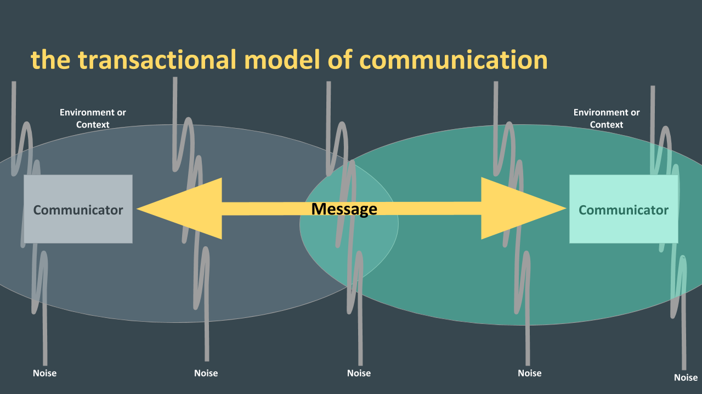

# Notes and Overview for Week 3
[ENGL 3301, Fall 2021](../calendar.html)

This week, we’re finishing our general introduction to TPW by taking a broad view and considering rhetoric as a foundational set of concepts for our work this semester. Again, like last week, these concepts are important, and we’ll come back to them again and again for the entire semester.  Starting next week, we will begin exploring particular strategies that technical writers use to make documents rhetorical, accessible, and effective for their audiences. Some of the stuff below gets a little heady, so as Downs notes in the chapter I've assigned to read, "buckle up!" Obviously we can't do a deep dive on rhetoric in one week, but we can do just enough to be dangerous, and that's okay with me for now.

<mark>Assigned to read this week:</mark>
  - Doug Downs, [Rhetoric: Making Sense of Human Interaction and Meaning-Making](https://dougdownsteaching.files.wordpress.com/2018/01/downs-rhetoric.pdf)

## Making meaning and models of communication

Downs posits that “[r]hetoric refers both to such principles of meaning-making, and to the use of those principles in a given interaction” (p. 459). This broadly constructed definition suggests that rhetoric:
  1. can be thought of as  an “operating system” (p. 460) that governs the way we experience and interact with the world. **Rhetoric is embodied and pervasive**.
  2. also refers to the ways in which those principles are enacted in the world. In other words, rhetoric is performative...it accomplishes things in the world. **Rhetoric does**.

I was originally planning to wax really (really (really)) long and introduce the foundations of rhetoric in 5th century BC Greece, but decided that would get us pretty far away from what we are doing. Instead, I want to start with the idea that **technical and professional writing is rhetorical**. One traditional model of communication you may have learned about is the "conduit" or "linear" model. (See Figure 1).

<figure><figcaption><i>Figure 1: The conduit model of communication</i></figcaption></figure>

In this model, the sender simply packages their content and sends it via some channel to a reciever, no muss or fuss unless a little noise, or interference, gets in the way. (Maybe that's literal background noise, like radio chatter while you're trying to talk to someone on that channel, or it's email problems on one or the other person's end, etc.) That's a gross oversimplification of communication and the model has a number of limitations. Messages aren't just passed from sender to receiver; we must interpret and decode information at the very least. The model also doesn't take into account senders' and receivers' different backgrounds and contexts, seeing them as relatively simply related. Finally, as anyone on Instagram should know, communication doesn't go in only one direction; it's a dynamic process.

A more dynamic model of communication is captured with the "transactional" model. (Lucky you, I've skipped a bunch of models in the middle!). Transactional models (though still an oversimplification, see figure 2) account for many of the weaknesses I just pointed out. Most importantly, unlike the one-way transmission of information to a passive reciever in the conduit model, communication from a transactional perspective is a cooperative. Communicators interact to **create meanings and share knowledge**; meaning is shared, and the various backgrounds, contexts, and environments of each communicator in the situation need to be accounted for as major factors impinging on understanding.

<figure><figcaption><i>Figure 2: The transactional model of communication</i></figcaption></figure>

Also important is the role of a shared environment or context (some communication scholars would refer to this as a "field of experience"). Downs's sections about motivation, knowledge-making, and identification will help you think about the ways relationships between all the various rhetorical agents (human and nonhuman) are part of a rhetorical conception of communication.

## Flexible and contextual conceptions of TPW

Okay, let's bring this back to TPW. Because it's the lifeblood of groups and organizations from large to small, technical and professional writing plays an important role in the construction of knowledge and meaning. <mark>(If you haven't read the Downs chapter yet, best go do that now before I lose you!)</mark>

Since knowledge is constructed, "knowing" and with it "passing along information" are trickier business than we might otherwise presume. Often people think about professional writing along the lines of that conduit model of communication. Writers can create knowledge in readers simply by exposing their audience to an idea. I simply write it down, send it out, and people read and then know it. right? Right? Wrong.

This is a poor model of communication, primarily because it presumes audience members are just passive recipients of information. And shared evidence does not simply translate to shared knowledge. For examples, we only have to look around at our widespread problems with disinformation and conspiracy theories in 2021. With conspiracy theorists in particular, the very nature of evidence and fact are brought into question, and if people have different ideas about the very basis of any argument: what counts as evidence of a phenomenon, well then there's really little chance for shared knowledge (that is, persuasion) to occur.

Data and evidence are not simply valid--they are **perceived as valid** by an audience. Or not. Because audiences vary in their assumptions, evidence that is valid for one group is invalid for another. Or, if you present valid data the wrong way or in a way that the audience won't recognize, you might as well have presented invalid data. The fact of social construction theory is that the people with power in any group decide what gets to count as knowledge.

We therefore cannot simply think of technical and professional writing as a transportation device for information, as something that gives "just the facts" without any interference from style or attention or delivery. It's always an angle, a perspective, a snapshot, and the audiences always have their own angle, their own perspective, their own snapshot. Rhetoric and persuasion are at the very heart of what we're doing. **Good technical writing, in the words of Carolyn Miller, "becomes, rather than the revelation of absolute reality, a persuasive version of experience"** (1979, p 616).

## For Tuesday
Complete the <mark>"Intro to TPW 4: Rhetorical Foundations" discussion forum</mark> in your group before 5:00 pm on Tuesday.

**Collaborate with your group to collect and post definitions of key terms from the reading, listed below**. These are definitions you'll be able to return to and throughout the semester, so it's important we're on the same page with them! You may copy and paste definitions from the text, but must also paraphrase them and _put them in your own words_.

This is a **collaborative** activity&mdash;work with the people in your group to divide and conquer the assignment. Assign each person in the group a different term or handful of terms. It's okay if you double up some, but each person should have something **different** to post.

The terms and concepts your group needs to define:

- Downs's five (5) rhetorical elements:
  - Motivation
  - Ecology
  - Knowledge making
  - Identification, and
  - the canons of rhetoric.
- Other important rhetorical terms:
  - kairos,
  - exigence,
  - rhetor,
  - audience (and the variety of ways it can be understood),
  - ethos, pathos, and logos,
  - discourse community.

You should also include with your definition a short reaction to Downs' chapter. What was interesting, confusing, or enlightening? How do you understand rhetoric differently now than you did before?

Google is your friend!

## For Thursday

Complete the <mark>"Intro to TPW 5: Yet more Rhetorical Foundations" discussion forum</mark> in your group before 5:00 pm on Thursday.

Look back at those six qualities of rhetoric again (Downs, p. 480). If something is rhetorical, it is:
- Situated
- Motivated
- Contingent
- Interactional
- Epistemic
- Embodied

For this post, go back to any two of the examples of TPW you’ve looked at over the previous three weeks, something from any of the assignments you already posted. Use these six qualities and any other relevant terms from the reading you're interested in to  explain how those texts are rhetorical. What does it mean that the document is rhetorical--and how does looking at it through this lens change how you think about it now versus when you might have looked at it before?

Then go in and respond to your peers' posts. Discuss, compare notes, and share ideas.

## Looking ahead

[Week 4](week-04-notes)

Importantly, keep looking for examples of technical/professional writing in your field!
