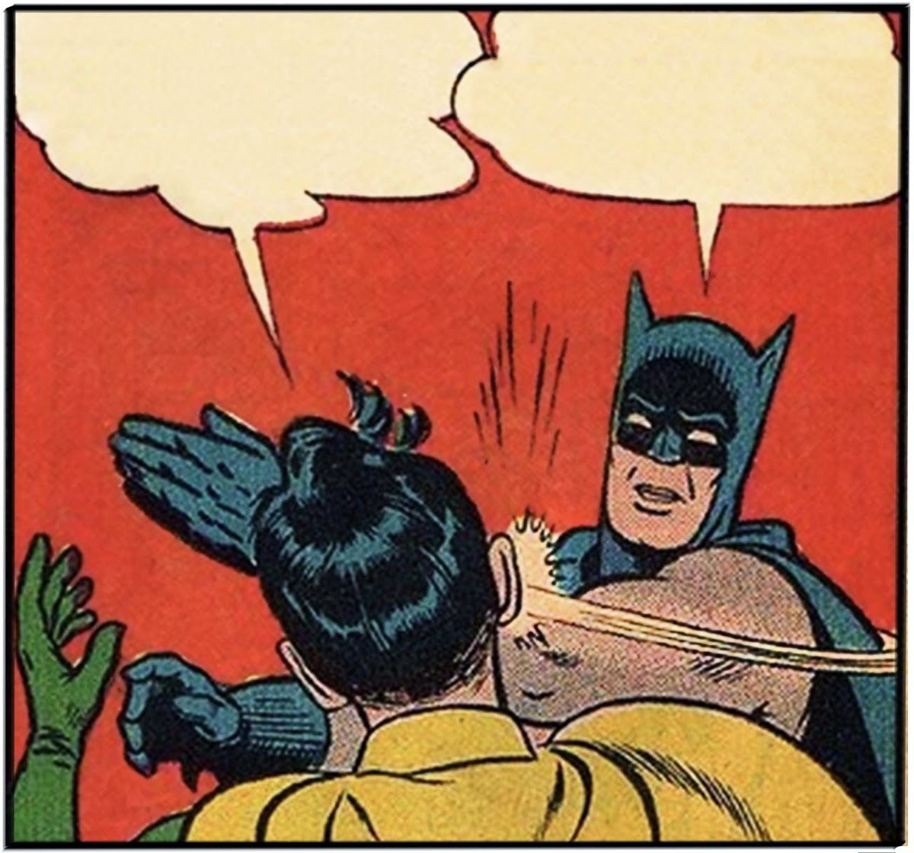

[ENGL 3301, Fall 2020](../calendar.html)

# Overview for Week 4

## Document design and "looking professional"

What does how a document looks and how a document works have to do with what a document does and who it's for? An effective document design helps your intended audience locate and understand the information they need when they need it. As you may realize from reading the assigned texts, designing uncluttered pages that are easy to read, meet and audience's genre expectations, and satisfy our own purposes is not as simple as it might sound. Because of all of the bells and whistles in our word processors, it's very easy to create ineffective documents.

<mark>Assigned to read this week:</mark>
- [Subheadings: Perhaps the Most Useful Technique in Technical Writing](https://idratherbewriting.com/2013/08/23/subheadings-perhaps-the-most-useful-technique-in-technical-writing/) is an excellent article about subheadings that also actually practices what it preaches.
- [Guidelines for Print Document Design](https://www.aph.org/aph-guidelines-for-print-document-design/) describes optimal usability standards for creating documents that persons with low vision can use (from American Printing house for the Blind)
- [TWE Chapter 3: Document Design](https://pressbooks.bccampus.ca/technicalwriting/part/documentdesign/) is a brief overview of essential factors for document design. Focus on the following sections:
  - [3.1 Readability](https://pressbooks.bccampus.ca/technicalwriting/chapter/readability/),
  - [3.2 Headings](https://pressbooks.bccampus.ca/technicalwriting/chapter/headings/), and
  - [3.3 Lists](https://pressbooks.bccampus.ca/technicalwriting/chapter/lists/)

- Optional reading: OTC Chapter 4: Document Design includes more in-depth treatments of the whys and hows of document design choices:
  - [4.4 Headings](https://alg.manifoldapp.org/read/open-technical-communication/section/86acfd75-0fcf-4f84-81aa-da087f3748a5)
  - [4.5 Bulleted and numbered lists](https://alg.manifoldapp.org/read/open-technical-communication/section/186ea758-92f6-4495-b6df-01061e39ec68)

<iframe width="640" height="389" src="https://docs.google.com/presentation/d/1-itoFjVtbyHlaBp79TP5tyXtl3fLC5Nt_cU00tC-neo/embed?start=false&amp;loop=false&amp;delayms=3000" frameborder="0" allowfullscreen="true" mozallowfullscreen="true" webkitallowfullscreen="true"></iframe>

## Formats, Templates, and Reinventing the Wheel

**Formats are rhetorical** A lot of us are probably familiar (at least in theory) with "APA Format" or "MLA Format" or some similar discipline-specific guideline for how your academic papers should *look* when you turn them in. More properly, these are referred to as "APA Manuscript Format" (etc.), because they're the editorial and design guidelines for preparing research and scholarly manuscripts (journal articles and books) for publication in those two organizations. The features of the school format are familiar, and many of you probably don't ever stop to think about them:

- Double-spaced
- 1-inch margins
- First-line indentation
- First-page or title-page identifying information (we'd call this a heading, but that can get confusing when we're talking about headings and subheadings in TPW!)
- Page numbers and sometimes a running header
- Times New Roman 12 pt font

But let's stop and look at those for a minute. Most of these aren't just arbitrary features--they are a particular design with a particular purpose in a particular situation. (And a few of them are decisions mediated for us by our computer software overlords.) The first three are features that are all about one thing: copyediting, or preparing a manuscript for final publication. To edit a manuscript, you need room to mark, correct, and query, and that's why manuscript publications (and tons of legal documents) are prepared in this format. It's a particular use case--and it's got nothing at all to do with helping readers read efficiently or effectively. (Same for Times New Roman. That's the default because when Microsoft Word became a popular desktop publishing tool, they had adopted TNR as their default. Before that, papers would have shown up as typewritten. That's why Calibri or Cambria are slowly becoming accepted defaults today--because we can only fight the defaults so hard!)

So lesson one is that some format issues are conventional and social: because groups use texts in a particular way over and over again, certain features or designs become conventional to facilitate repeated use. Other format issues are technological or mediated: because the technology allows or encourages certain activities, we often do them, because we love our machine overlords. Sometimes these format conventions become codified in things like templates and genres.

**Templates are fine** Here's an example of a template you've hopefully seen at this point in culture. Templates are do all the design, formatting, and layout work for you (mostly), and all you have to do is plop in the content.

I don't plan to wax especially philosophical about templates&mdash;document formats that let you just 'fill in the blanks' and have a document that looks and smells nice. For sure you should learn to use them; many workplaces will have document templates they'll want you to use, and knowing how document styles work is helpful. Some of you will even have to create templates for others to use.

Built-in templates are a standard feature for word processing software. Use them, but use them critically and be aware that although templates provide tons of style, they don't provide substance for you. In lots of cases, they are catch-alls that can't account for the variety of ways people might need to put together genres like a resume, cover letter, or formal report.

**Reinventing the wheel** I mean, you don't have to do that most of the time. If there's a template or format out there, feel free to use it. On the other hand, this class is a safe space to experiment and try weird stuff out with document design features. Just be ready to back your play and explain why you did what you did!

## Genres and TPW

Adapted from CCBY content at https://openoregon.pressbooks.pub/technicalwriting/chapter/14-2-genre-genre-sets-genre-systems/

I keep throwing around that word "genre," but I haven't defined it for you yet.

When you hear or read the word “genre,” what comes to mind? For most of us, the word makes us think of kinds–or types–of music, books, or films. Typically we use this word to differentiate between country, rock, classical, or hip hop music; between science fiction, romance, biography, or self-help books; between comedies, dramas, action/adventure films, or documentaries. But when TPW people use the term “genre,” they mean something a little different.

In TPW a "genre” refers to a typical way of organizing, presenting, and using language in situations that recur–or repeat–over time. Some examples before returning to a working definition:

- A complaint letter
- An insurance claim
- A job description
- A legal brief
- A proposal
- A syllabus
- A receipt or a bill-of-sale
- A restaurant menu
- A to-do list

In every one of the examples above, you can pretty easily imagine who uses the text, where, when, and for what purposes. A job description is created by a company to advertise a particular position and/or to outline the responsibilities for the person applying/hired. It is either an official document (when used for an employee) or it is a tool used to hire somebody (both company/organization and potential candidates use the description to decide if a person is qualified).

In other words, genres are really **texts-in-use**, or **texts that facilitate achieving some kind of purpose or goal for people**. They are not just descriptions–they are actions. So while it is tempting to think of the forms you fill out at the doctor’s office describing recent symptoms as just a simple text or a piece of writing, when we really study writing, we have to think about how that piece of writing facilitates the doctor-patient relationship. Genres happen in and because of social contexts.

Knowing who uses a text and why they use it helps us to figure out what the content of a piece of writing needs to be as well as how to present that content. Consider the job description again: It typically begins with an overview of the job as well as minimum qualifications. Why does it begin there? Why isn’t this information at the end, or in the middle somewhere? The overview acts as a kind of advertisement; it is there to attract candidates to the position. But the minimum qualifications quickly help candidates to consider whether or not they should apply–which in turn saves the company extra work identifying people who do not qualify. In that sense, the minimum qualifications help both the job searcher and the company work more efficiently.

But, some of you might be thinking, sometimes the minimum qualifications are found later in the job description. That is true. Can you imagine a reason for that? If so, you have identified another important principle that applies to genres: **genres often have typical features and designs, but genres aren’t formulas**. In other words, there is not one exact way to write them. Instead, genres are governed by what are called “conventions” or guiding principles. We can speak generally about how to write any given genre, but there are always likely to be exceptions based in specific communities and organizations that circulate genres. (This is why adopting a curious attitude about writing, instead of simply looking for the “right way” to write something, will serve you better as a professional. It will also help alleviate frustration when what you thought was the “right way” to write something ends up requiring editing or modification.)

The table below shows some of the most common [genres we talk about in technical communication](https://genreacrossborders.org/research/technical-communication). Of course, there are many, many others specific to particular professions, communities, and organizations.

| Basic Genres of TPW | But really we're talking specific genres like: |
|---|---|
| Correspondence | Letters, Memos, Email, Text Messages, Instant messaging, Social media posts |
| Reports | Technical reports, Progress reports, Recommendation reports, Feasibility reports, Research reports, Laboratory reports, Oral reports |
| Proposals | Grant proposals, White papers, Internal & External proposals, Solicited & Unsolicited proposals, Requests for proposals |
| Manuals | Product manuals, User manuals, Operations manuals, other kinds of manuals... |
| Stuff that doesn't quite fit in those categories | Meeting minutes, Resumes, Policies and Procedures, Blogs, Website copy, MIssion/Purpose statements, Forms of many different kinds, Statements of many different kinds, Stuff that's super-specific to fields and workplaces, |
| And there's even more that I couldn't list here... |   |

Swales 2004, "constellations of genres"
Bazerman 1994, genre system, "interrelated genres that interact with each other in specific settings"

# For Tuesday

Complete the "Hurricane DocDesign" assignment in the Week 4 folder

- Review the [City of Corpus Christi 2020 Hurricane Preparedness handout](https://www-cdn.cctexas.com/sites/default/files/FIRDEP-eoc-hurricane-prepardness-information.pdf)
- Evaluate the handout's design: what works, what doesn't, and why? Consider at least five of the following points, and come up with specific revisions for improving any problem areas you discover in the handout:
  - How effectively has the designer used blank space to frame/group information?
  - Are there too many lists? Not enough lists? The right type of lists?
  - Is type of a legible size, color, and design?
  - Is text spaced adequately for reading and skimming?
  - Are line length and margin style effective?
  - Are words and illustrations complementary?
  - Does the designer use frequent, descriptive, and distinctive headings?

Write a letter, memo or email that you might send to the City of Corpus Christi Office of Emergency Management suggesting your revisions. Decide whether you want to write this from the perspective of a concerned citizen, a thoughtful city employee, or some other role, and select an appropriate genre and format. In your communication, help your readers scan and locate information by using descriptive, distinctive headings and other document design elements.

Upload your letter, memo, or email as a Word document to the assignment in Blackboard.  In the "comments" with your submission, explain why you chose the format you did and what difficulties or successes you had.

Bonus: Use the "Styles" option in Word to create your headings and other design elements.

# For Thursday

Participate in the "Communicating Profesh" discussion forum in your group.

Think about the word **professionalism**. What does that mean? What images does your mind's eye conjure up? If you [do a Google image search of "professional" whose picture are you most likely to see](https://theconversation.com/googles-algorithms-discriminate-against-women-and-people-of-colour-112516)?

Read three or four of these articles about race, culture, authenticity, and how we perform professionalism:
  - [Authenticity in the workplace as a Latinx professional](https://www.alley.com/post/authenticity-in-the-workplace-as-a-latinx-professional) (video)
  - [Why professional dress? Dress Profesh](https://dressprofesh.com/whydress) (video)
  - [The bias of professionalism standards](https://ssir.org/articles/entry/the_bias_of_professionalism_standards)
  - [Racism runs deep in professionalism culture](https://tulanehullabaloo.com/51652/intersections/business-professionalism-is-racist/)
  - [U.S. Latinos feel they can't be themselves at work](https://hbr.org/2016/10/u-s-latinos-feel-they-cant-be-themselves-at-work)
  - [Minorities who 'whiten' job resumes get more interviews](https://hbswk.hbs.edu/item/minorities-who-whiten-job-resumes-get-more-interviews)

A few years ago in a tech writing class, we were talking about email when a student (who was already working for a law firm in town) commented "I think I should be able to use a pink font in my emails if I want to." "Damn right," I replied. Look, there are legitimate concerns about accessibility and color contrast. Using pink on white is physiologically difficult to read because the contrast ratio is so low. But the issue here is real--how much latitude can and should we have to massage genre conventions, especially because many of our ideas about *appropriate* style and professionalism are deeply [gendered](https://academic.oup.com/jcmc/article/11/4/1012/4617714) and [racial](https://www.academia.edu/download/35205268/Medina_Tweeting_Identity_CRE.pdf)? Should we--and how can we--convey something about ourselves in genres like resumes, emails, and cover letters? How much of ourselves do we put on our LinkedIn profile? What are the distinctions between our personal and  professional identities? [Which people in the same working environment have to dress up, how far, and why? Which races and genders get to be outspoken, and what happens when someone from a group speaks up?](https://money.cnn.com/2015/11/25/news/economy/racial-discrimination-work/index.html) And why is it okay for all the old white dudes on the faculty to wear Hawaiian shirts?

How does all that translate over to professional writing? How do you want people to see you? What do you want them to know about you? How might you represent that in your writing and document design?

**After reading and reflecting on these articles, write a post in your "Communicating Profesh" group forum responding to the following questions:**
  - When working within the standard written genre conventions and document designs of resumes, formal letters, emails, and text messages, how can you maintain (or convey a sense of) who you are and what you value?
  - What institutions and/or structures shape how you understand “professional behavior”? What’s considered “normal” professional behavior? What are the consequences of participating in structures that reinforce normative notions of professionalism? What might it look like to resist such structures?
  - Yes, refer back to your readings as you develop your response.
  - Yes, discuss and converse with your group.
  - Yes, write no fewer than 250 words. Probably more for this one.

# Looking ahead

In [week 5](week-05-notes) we're getting into style: words, sentences, and all that good stuff. Buckle up!
