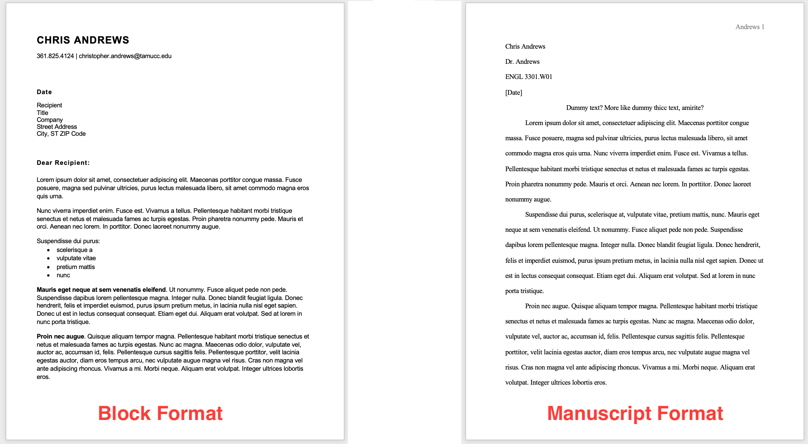

# Notes and Overview for Week 4
[ENGL 3301, Fall 2021](../calendar.html)

Over the next few weeks (4-8) we're exploring elements of technical and professional writing. With our foundational work with audience, purpose, and rhetoric in mind, in this unit we'll survey and learn about specific writing styles, document designs, visual features and other concerns for writers in your field, discipline, or major. In order to do that, we'll focus on two things:

1. Each week, as we discuss and read about document design, writing styles, and visual components, you'll apply those practices to iterative revisions of your "Professional sites and resources" memo you turned in during week 02.
2. You'll also begin working on the first major project: [A fact sheet about writing in your field](https://cdmandrews.github.io/3301/project-1). Your fact sheets are due during Week 08, and we will do a couple of collaborative discussions and peer review sessions over the next few weeks to help you understand the task and to get feedback from your group on the document you're working on.

Please review the [project instructions](https://cdmandrews.github.io/3301/project-1) now, and ask me questions early and often. This project does involve independent research, but more on that in the project instructions.

Informal assignment: **After you've read the project description thoroughly (and checked the syllabus for due dates), you should e-mail me at some point this week with questions you have about the first project**. I'll put these all together into an FAQ about the project.

## Document design and "looking professional"

This week, we're starting our exploration of elements of TPW with **document design**

What does *how a document looks* have to do *with what that document does and who it's for*? Technical communicators use **design** to increase **readability** and **[usability](https://www.usability.gov/what-and-why/usability-evaluation.html)**. An effective document design helps your intended audience locate and understand the information they need when they need it. Usability means users can satisfactorily use a document to find information or complete tasks. Effective design should also be **[accessible](https://webaim.org/intro/)**--it should work for as many people as possible, despite visual or cognitive disabilities or other conditions of access like slow connection speeds or small screens.

As you may realize from reading the assigned texts, designing uncluttered pages that are easy to read, meet an audience's genre expectations, and satisfy our own purposes is not as simple as it might sound. Because of all of the bells and whistles in our word processors, it's easy to create ineffective documents.

<mark>Assigned to read this week:</mark>
- [Subheadings: Perhaps the Most Useful Technique in Technical Writing](https://idratherbewriting.com/2013/08/23/subheadings-perhaps-the-most-useful-technique-in-technical-writing/) is an excellent article about subheadings that also actually practices what it preaches.
- [Guidelines for Print Document Design](https://www.aph.org/aph-guidelines-for-print-document-design/) describes optimal usability/accessibility standards for creating documents that persons with low vision can use (from American Printing house for the Blind)
- [TWE Chapter 3: Document Design](https://pressbooks.bccampus.ca/technicalwriting/part/documentdesign/) is a brief overview of essential factors for document design. Focus on the following sections:
  - [3.1 Readability](https://pressbooks.bccampus.ca/technicalwriting/chapter/readability/),
  - [3.2 Headings](https://pressbooks.bccampus.ca/technicalwriting/chapter/headings/), and
  - [3.3 Lists](https://pressbooks.bccampus.ca/technicalwriting/chapter/lists/)

- Optional reading: OTC Chapter 4: Document Design includes more in-depth treatments of the whys and hows of document design choices, but largely covers the same territory as TWE chapter 3:
  - [4.4 Headings](https://alg.manifoldapp.org/read/open-technical-communication/section/86acfd75-0fcf-4f84-81aa-da087f3748a5)
  - [4.5 Bulleted and numbered lists](https://alg.manifoldapp.org/read/open-technical-communication/section/186ea758-92f6-4495-b6df-01061e39ec68)

Finally, here's a brief slideshow on document design, including CRAP principles of visual design and distinctions between visual perception, visual culture, and visual rhetoric, and some examples.

<iframe width="640" height="389" src="https://docs.google.com/presentation/d/1-itoFjVtbyHlaBp79TP5tyXtl3fLC5Nt_cU00tC-neo/embed?start=false&amp;loop=false&amp;delayms=3000" frameborder="0" allowfullscreen="true" mozallowfullscreen="true" webkitallowfullscreen="true"></iframe>

### Formats, Templates, and Reinventing the Wheel

**Formats are rhetorical** A lot of us are probably familiar (at least in theory) with "APA Format" or "MLA Format" or some similar discipline-specific guideline for how your academic papers should *look* when you turn them in. More properly, these are referred to as "Manuscript Format" (etc.), because they're the editorial and design guidelines for preparing research and scholarly manuscripts (journal articles and books) for publication. Sometimes you'll see manuscript format referred to as "school format," because it's used more commonly there than most anywhere else. Figure 1 shows some differences between block format (left) and manuscript format (right).

<figure>
<figcaption><em>Figure 1: What are some visual design differences between "Block format" and "Manuscript format"?</em></figcaption></figure>

The features of manuscript format are familiar, and many of us probably don't ever stop to think too much about them:

- Double-spaced
- 1-inch margins
- First-line indentation
- First-page or title-page identifying information (we'd call this a heading, but that can get confusing when we're talking about headings and subheadings in TPW!)
- Page numbers and sometimes a running header
- Times New Roman 12 pt font

But let's stop and look at those for a minute. Most of these aren't just arbitrary features--they are a particular design with a particular purpose in a particular situation. (And a few of those features are decisions mediated for us by our computer software overlords.) The first three are features that are all about one thing: copyediting, or preparing a manuscript for final publication. To edit a manuscript, especially on paper, editors need room to mark, correct, and query, and that practice of correction and annotation is why manuscript publications (and tons of legal documents) are prepared in this format. Double-spacing has a particular use case--and it's got nothing at all to do with helping readers read efficiently or effectively. Same for Times New Roman. That's the default because when Microsoft Word became a popular desktop publishing tool, they had adopted TNR as their default. Before that, papers would have shown up as typewritten. For many people, Calibri or Cambria are slowly becoming accepted defaults today--because we can only fight the defaults so hard!

So lesson one is that **some format issues are conventional and social**: because groups use texts in a particular way over and over again, certain features or designs become conventional to facilitate repeated use. I can use a document in a particular way easier if it looks the way I expect it to. Other format issues can be **technological or mediated**: because the technology allows or encourages certain activities, we often do them, because we love our machine overlords. Sometimes these format conventions become codified in things like templates.

Templates are fine Here's an example of a template you've hopefully seen at this point in culture. Templates are do all the design, formatting, and layout work for you (mostly), and all you have to do is plop in the content (see Figure 2).

<figure>

<figcaption><i>Figure 2: Visual memes are a kind of template.</i></figcaption><figure>

I don't plan to wax especially philosophical about templates&mdash;document formats that let you just 'fill in the blanks' and have a document that looks and smells nice. For sure you should learn to use them; many workplaces will have document templates they'll want you to use, and knowing how document styles work is helpful. Some of you will even have to create templates for others to use. Built-in templates are a standard feature for word processing software. Use them, but use them critically and be aware that although templates provide tons of style, they don't provide substance for you. **Templates are not genres** (more on genre in the next section). In lots of cases, templates are catch-alls that can't account for the variety of ways people might need to put together genres like a resume, cover letter, or formal report.

**Templates in this class** I mean, you don't need to reinvent the wheel most of the time. If there's a template or format out there, feel free to use it for this class. (If you were in our Doc Design class, of course, the professor would tell you no templates allowed; that's because if you're expected to be doing the design work yourself, templates are basically cheating...) On the other hand, this class is a safe space to experiment and try weird stuff out with document design features. Just be ready to back your play and explain why you did what you did!

But in general, manuscript format is not cool in this class. Not because I hate it--I use it all the time--but because I want you to push out and try other things.

### Genres and TPW

Adapted from CCBY content at https://openoregon.pressbooks.pub/technicalwriting/chapter/14-2-genre-genre-sets-genre-systems/

When you hear or read the word **genre**, what comes to mind? For most of us, the word makes us think of kinds&mdash;or types&mdash;of music, books, or films. Typically we use this word to differentiate between country, rock, classical, or hip hop music; between science fiction, romance, biography, or self-help books; between rom-coms, thriller dramas, action and adventure films, or documentaries. But when TPW and other writing studies people use the term “genre,” they mean something a little different.

**In TPW a genre refers to a typical way of organizing, presenting, and using language in situations that recur&mdash;or repeat&mdash;over time**. Some examples before returning to a working definition:

- A complaint letter
- An insurance claim
- A job description
- A legal brief
- A proposal
- A syllabus
- A receipt or a bill-of-sale
- A restaurant menu
- A to-do list

In many of the examples above, you can pretty easily imagine who uses the text, where, when, and for what purposes. A job description is created by a company to advertise a particular position and/or to outline the responsibilities for the person applying/hired. It is an official document (when used for an employee) and it is also a tool used to hire somebody (both company/organization and potential candidates use the description to decide if a person is qualified).

In other words, genres are really **texts-in-use**, or **texts that facilitate achieving some kind of purpose or goal for people**. They are not just descriptions; they are actions. So while it is tempting to think of the forms you fill out at the doctor’s office describing recent symptoms as just a simple text or a piece of writing, when we really study writing, we have to think about how that piece of writing facilitates the doctor-patient relationship. Genres happen in and because of social contexts.

Knowing who uses a text and why they use it helps us to figure out what the content of a piece of writing needs to be as well as how to present that content. Consider the job description again: It typically begins with an overview of the job as well as minimum qualifications. Why does it begin there? Why isn’t this information at the end, or in the middle somewhere? The overview acts as a kind of advertisement; it is there to attract candidates to the position. But the minimum qualifications quickly help candidates to consider whether or not they should apply–which in turn saves the company extra work identifying people who do not qualify. In that sense, the minimum qualifications help both the job searcher and the company work more efficiently.

But, some of you might be thinking, sometimes the minimum qualifications are found later in the job description. That is true. Can you imagine a reason for that? If so, you have identified another important principle that applies to genres: **genres often have typical features and designs, but genres aren’t formulas**. In other words, there is not one exact way to write them. Instead, genres are governed by what are called “**conventions**” or guiding principles. We can speak generally about how to write any given genre, but there are always likely to be exceptions based in specific communities and organizations that circulate genres. This is why **adopting a curious attitude about writing, instead of simply looking for the “right way” to write something, will serve you better as a professional**. It will also help alleviate frustration when what you thought was the “right way” to write something ends up requiring editing or modification.

The table below shows some common [genres we talk about in technical communication](https://genreacrossborders.org/research/technical-communication). Of course, there are many, many others specific to particular professions, communities, and organizations.

| Basic Genres of TPW | But really we're talking specific genres like: |
|---|---|
| Correspondence | Letters, Memos, Email, Text Messages, Instant messaging, Social media posts |
| Reports | Technical reports, Progress reports, Recommendation reports, Feasibility reports, Research reports, Laboratory reports, Oral reports |
| Proposals | Grant proposals, White papers, Internal & External proposals, Solicited & Unsolicited proposals, Requests for proposals |
| Manuals | Product manuals, User manuals, Operations manuals, other kinds of manuals... |
| Stuff that doesn't quite fit in those categories | Meeting minutes, Resumes, Policies and Procedures, Blogs, Website copy, MIssion/Purpose statements, Forms of many different kinds, Statements of many different kinds, Stuff that's super-specific to fields and workplaces, |
| And there's even more that I couldn't list here... |  See other concepts, like: 1) Swales 2004, "constellations of genres"; 2) Bazerman 1994, genre systems, "interrelated genres that interact with each other in specific settings" |

## For Tuesday

Complete the <mark>Elements 1: Document Design individual assignment</mark> before 5:00 on Tuesday.

<em>The assignment for this Tuesday is NOT in your group forums; it's an individual file upload (to facilitate me putting feedback on your document). Look in the "Course Content" folder and then the "Weeks 4-8: Elements of TPW" subfolder to find today's assignment. Alternatively, you can find a link to it via the Calendar tool in Blackboard. For this assignment and the next few Tuesdays, you will revise different aspects of your "Professional sites and resources memo" from Week 2. </em>

1. After reading this week's materials on document design, **revisit and revise the design** for your "Professional sites and resources" memo, paying particular attention to typefaces, colors, white space, overall format choices, and the general CRAP-ishness of your design. You are free to redesign your memo however you like. These changes might be major or minor, but there should be changes. You may also revise any language or content in your memo that you wish to. However, I'll primarily focus my feedback on your design at this stage, and we will focus on writing style in the weeks to come.

2. Post your redesigned memo to the "Elements 1: Document Design" assignment in Blackboard. Upload your text as a Word document or PDF.

3. In the "comments" with your submission, reflect briefly on the assignment, explaining why you chose the format you did and what difficulties or successes you had.

## For Thursday

Participate in the <mark>"Intro project and analyze fact sheets genre"</mark> discussion thread in your group before 5:00 pm on Thursday.

So I guess you have to make a fact sheet about writing in your field. But what the heck is a fact sheet? What do those look like, who uses them, what sorts of work do they do? That's what we're answering today.

For this assignment, you're going to analyze the document design and other features of some example fact sheets. These examples will help you think of different ways you might put together your own fact sheet for project 1.

This discussion activity will be collaborative. So that you get the benefit of everyone's eyes on a lot of different things, each person in your group should review different examples. Your group will need to get organized before doing this discussion, just as we did last week.

1. Review the list of example fact sheets I've shared via the [project description page](https://cdmandrews.github.io/3301/project-1#looking-at-examples-of-fact-sheets) and divide the list among your group members. Each person in your group should review two *different* fact sheets. You can [download and use this document to help assign or coordinate volunteers](factsheet-grouplist.docx). Each of the organizations on that list will have multiple fact sheets on their website, so if each person picks a different organization that should work.

2. Individually analyze your two fact sheets. In the discussion forum, post a summary of  the following information (nested lists or a table would seem to work best for this, but you don't have to upload a separate document):
  - What's the title or subject of the fact sheet?
  - Who's using the fact sheet and why? What company or organization created the fact sheet, and what is the fact sheet's specific audience(s)? What actions is the fact sheet helping those audiences to take?
  - What are key features of each fact sheet? Look at its *design features* (headings, lists, colors, type, paragraphing, and white space), *use of visuals* (pictures, tables, charts), and *writing style* (long sentences or short? technical language or simple? tone?)

3. After everyone has posted their information on Thursday, review everything and have an informal discussion: What are **recurring features, audiences, and purposes** for these fact sheets? What makes a fact sheet a fact sheet? Finally, what do these examples tell you or show you that you can apply as you're creating your own fact sheets?

## Looking ahead

In [week 5](week-05-notes) we're dipping our toes into style and reader-centered writing: words, sentences, and all that good stuff. Buckle up!
