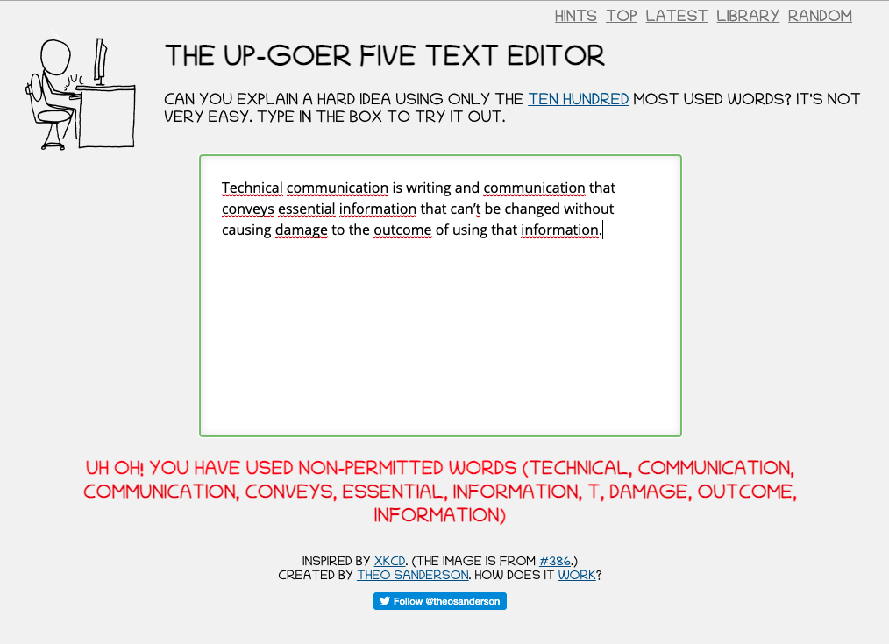
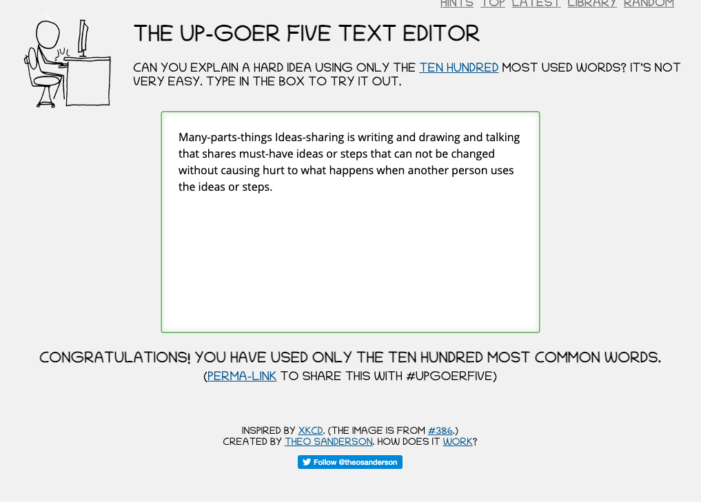

# Notes and Overview for Week 5
[ENGL 3301, Fall 2021](../calendar.html)

<mark>Assigned to read this week:</mark>
-  [3.1 Readability](https://pressbooks.bccampus.ca/technicalwriting/chapter/readability/),
- [OTC 5.5: Articulating Technical Discussions](https://alg.manifoldapp.org/read/open-technical-communication/section/39c29f74-f502-4050-80b3-1162a9cdd8b0)
- Review the following sections of the Federal Plain Language Guidelines:
  - [Choose your words carefully](https://www.plainlanguage.gov/guidelines/words/) has 8 subpages
  - [Be concise](https://www.plainlanguage.gov/guidelines/concise/) has 5 subpages
- ["Science in Ten Hundred Words: The 'Up-Goer-Five' Challenge"](https://blogs.scientificamerican.com/guest-blog/science-in-ten-hundred-words-the-up-goer-five-challenge/)

## Readability: Writing Styles and Reader-Centered Content

Reader-centered vs. Writer-centered style

Whenever possible, write so that busy people understand what you are saying the first time they read it. You don't have to snazz it up; help your reader's valuable attention by focusing your sentences on the most important thing. Keep things simple! One way writers can do this is by using **reader-centered** messages that make clear how the message will affect readers. Reader-focused writers look at the situation from the reader's point of view and adjust content, structure, and tone to meet their needs.

Reader-centered messages use the pronoun "you" to center the message on the reader, while writer-centered messages rely on "I" and "we." Reader-centered messages use what's called a **"you attitude"**. To write with a "you attitude":
1. Focus on what the reader needs and values
2. In neutral or positive situations, use reader-focused pronouns (you)
3. Avoid discussing your own feelings
4. Refer to specific, relevant information

Three short examples showing the difference between writer-centered and reader-centered statements:
>  "I have worked hard to get you the best contract possible."

In this first  example the writer emphasizes how they worked rather than the benefits that the reader will receive. Sure, it's nice that they worked hard, but that's not really the important message. See also letters saying "We are excited to inform you that..." Some common email phrases that discuss your own feelings instead of getting to the point include "I was wondering if it would be okay if I could..." and "I just wanted to let you know..." It's okay to get to the question.

> "You'll be happy to learn that we're ready to offer you the best contract possible."

In the second example, the writer begins by telling the reader how to feel. And *nobody tells me how to feel*!

> "Under the new contract you'll receive dental insurance."

This third sentence starts with the important information&mdash;the new contract&mdash;and gives specific, relevant details about it. You get dental now. Consider the difference between everyone's favorite Amazon email: "We shipped your order today" versus "Your order will arrive on Thursday." Which sentence works better for the person watching out for porch pirates?

For negative situations, writer-centered messages prove more effective than reader-centered messages because negative reader-centered messages can trigger defensive responses. For instance, “*You need to send us your overdue balance of $550 or we'll probably take you to court*” will likely cause a negative reaction. Compare that to: “*Please pay the overdue balance of $550 to avoid possible legal actions. If you need help making this payment, please contact our credit department for assistance*."  

Along with using "you", writers can also be reader-centered by writing in a conversational tone rather than a stiff, legalistic one: "*The changes agreed upon per our conversation are herein included.*" is exceedingly formal and doesn't really sound like it's written for human consumption. On the other hand, "*The changes included here were the ones we discussed during our telephone conversations*" sounds like there's a person on the other end of the line.

The following slideshow reviews these principles in further detail and walks through some examples:

<iframe width="640" height="389" src="https://docs.google.com/presentation/d/e/2PACX-1vTHSfXuKcRoNwjjhebBNo2GEiGuWZzkLKS0aRlKOz3j5_EucMAVx8SgdQxc6Ee9t0Vpgan4nlauZn0b/embed?start=false&amp;loop=false&amp;delayms=3000" frameborder="0" allowfullscreen="allowfullscreen" mozallowfullscreen="mozallowfullscreen" webkitallowfullscreen="webkitallowfullscreen"></iframe>

### Technical terms and jargon

Technical terms are essential in technical and professional writing--especially when you're dealing with technical and scientific fields, but also with all kinds of professions and areas. Each field uses a vocabulary to relay specialized concepts by means of technical language. These special terms convey concentrated meanings that have been built up over time and use. Technical terms are really devices for efficiency among experts: they take big ideas and information and condense it all into a single word. The same thing goes for acronyms and abbreviations: when people share knowledge or a discourse community, they can use acronyms and initialisms (RADAR, LARPing, TDY, ADHD, YOLO, ROTFLMAO) and abbreviations (2D, 5G, app, demo, IP) to communicate more quickly and efficiently.

<iframe width="560" height="315" src="https://www.youtube.com/embed/igPIk79wAPg" frameborder="0" allow="accelerometer; autoplay; clipboard-write; encrypted-media; gyroscope; picture-in-picture" allowfullscreen></iframe>

At the same time, technical terms can make your prose dense and difficult to understand, even for the specialized reader. So it's not a question of using it all the time or ignoring it all the time--like everything else, words are choices. If you're going to used specialized terminology, stick to the following guidelines:

- Match terminology to your audience's needs and background. Don't assume they know it all. What is their level of understanding of the topic? Do you need to use more general terms?  
- Provide clear definitions or explanations of unfamiliar terms. If you are using a specialized term that is not widely used in your audience, even if the audience is an expert one, be sure you provide a clear definition of your term. That just helps everyone be on the same page.
- If you want to use an acronym that's not popularly known, spell out the entire thing the first time you use it and provide the acronym in parenthesis directly afterward. Then you can use the acronym for the rest of your document.
- Use a terminology list when you are introducing a variety of new terms into your discussion. Glossaries or terminology lists, very common in science and engineering, helps readers who want to remind themselves what you mean by a term.

Also be aware of how [jargon can be used to dress up or obfuscate the truth](https://plainlanguage.gov/resources/articles/keep-it-jargon-free/). Are we in a "period of economic readjustment," or a "recession"? Is your company "implementing a skills mix adjustment" or "downsizing" or did you really just get fired?

## For Tuesday

Complete the <mark>2.3 Project 1 Q&A</mark> thread in the "Module 2 forum: Elements of Technical and Professional Writing" before 5:00 on Tuesday.

Review the [instructions for Project 1](https://cdmandrews.github.io/3301/project-1) again. Post 3 questions you have about the project as replies to this thread. If you can answer someone else's question, please do so! Then check back in a day or so for answers to your group's questions and some other follow-ups from me.

## For Thursday

Participate in the <mark>"2.4: Readability"</mark> discussion thread in your group before 5:00 pm on Thursday.

Can you take a complex topic and explain it in a way that someone unfamiliar with the field can understand? For this post, you're going to use the "Up-Goer Five Text Editor" (https://splasho.com/upgoer5/) to explain a hard idea using only the ten hundred most used words. The "Up-Goer Five Text Editor" was inspired by an [XKCD comic](https://xkcd.com/1133/); when you type in the text entry box, the tool compares the words you enter against a list of the most commonly used English words and flags you when you use a word that's not on it. For example, Figure 1 is Alex Pope's definition of technical communication--we looked at it in Week 2. I plopped it into the editor, and it flagged nine words as not on the list!

<figure>
<figcaption><i>Figure 1: The red squiggles aren't spelling errors; they are words that aren't on the list of common English words</i></figcaption>
</figure>

So, I revised it until I got a definition that got no red flags. See Figure 2:

<figure>
<figcaption><i>Figure 1: Whew! That one was even tough for me!</i></figcaption>
</figure>

Here's your prompt:
1. Pick a complex word or phrase that you've learned about in one of your other classes, preferably a highly specialized concept from your major. The harder, the better! () Use the Up-Goer Five Text Editor to write an explanation of that concept, using ONLY the words it permits you to. Copy and paste your explanation and post it as a reply on this thread.
2. Then start a new paragraph and reflect and comment on the experience. How did that writing experience go for you? What words were hardest for you to 'translate'? This is an extreme example, and the Up-Goer Five Editor isn't necessarily how you should approach technical writing, but what did you learn about writing style or explaining difficult concepts as a result of this activity?
3. Come back later and read your peers' explanations and reflections, and talk about what you learned.

## Looking ahead

In [week 6](week-06-notes) going to work with the concept of Findability, or emphasizing key messages in your writing. You'll also submit a first draft of your own fact sheet for review. Be working on that project!
