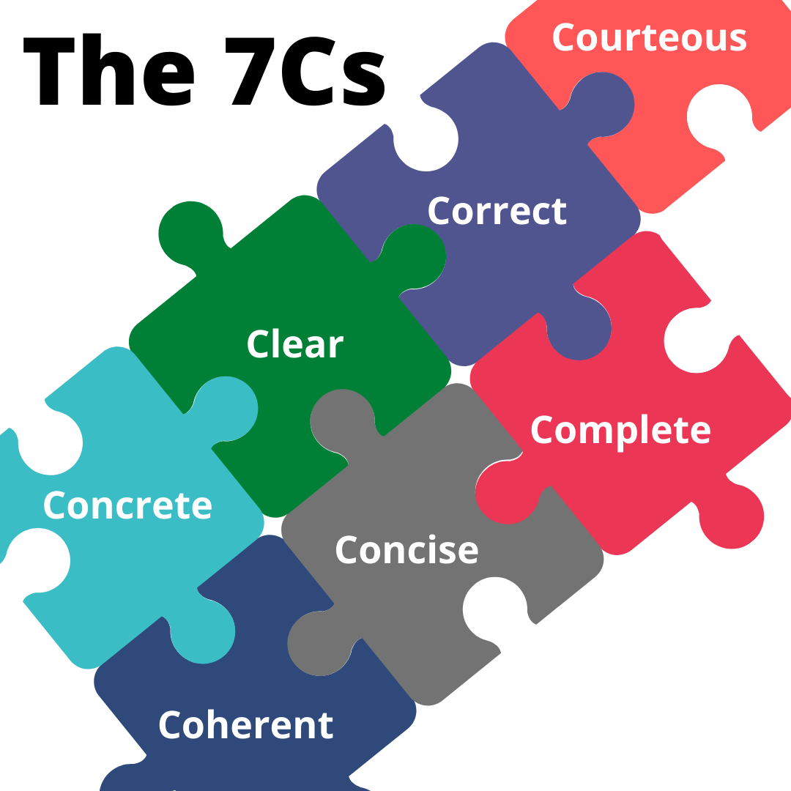

# Notes and Overview for Week 7
[ENGL 3301, Fall 2021](../calendar.html)

We are continuing our focus on **writing style** this week, with a particular focus on style and structure. Style is the way you express your ideas in a document, from the paragraph level to sentence structure and the words and phrases you use. Style is different from correctness, which has to do with squeaky-clean grammar, mechanics, and spelling. As your reading this week will point out, style guidelines ([such as the 7Cs](the-7cs)) can conflict with each other, and there are always tradeoffs. **As a writer, you need to be able to notice different styles when you see them and make decisions about when to use a particular style or not**.

You also are working on your fact sheets this week, and we will have our first peer review session for those. You'll need a [rough draft of your fact sheet about writing in your profession for project 1 ready by Thursday](../project-1). More details on that below.

<mark>Assigned to read this week</mark>
- [BLUF: The military standard that can make your writing more powerful](https://www.animalz.co/blog/bottom-line-up-front/) Bottom-line up front, aka Conclusions-first is a powerful approach for many kinds of professional writing.
- [The bite, the snack, and the meal](https://ewriteonline.com/bite-snack-and-meal-how-to-feed-content-hungry-site-visitors/) is an approach to web content writing that you will find useful more broadly in your professional writing, as it emphasizes making your key message clear in three "sizes."
- [Effective rhetoric, effective writing: Parallelism in technical communication](https://helenfawcett.com/effective-rhetoric-effective-writing-parallelism-in-technical-communication/) introduces parallelism at the sentence level.
- Revisit [Subheadings: Perhaps the most useful technique in technical writing](https://idratherbewriting.com/2013/08/23/subheadings-perhaps-the-most-useful-technique-in-technical-writing/) is an excellent article about subheadings that also actually practices what it preaches.
- Revisit chapter [3.2 Headings](https://pressbooks.bccampus.ca/technicalwriting/chapter/headings/)

### Balance your 7cs
The 7Cs of communication are principles for "good technical and professional writing." They have come up in our readings a few times, but I haven't done much editorializing about them yet. [This short article](the-7cs) overviews some of the complications related to navigating the 7Cs as a real, live, human being.

The 7Cs are a useful short checklist of qualities effective communication ought to have. Good technical writing is:

<figure><figcaption><i>Figure 1: The 7Cs: No problem, right?</i></figcaption></figure>

### Emphasize your key messages

Whenever you communicate, whether you're informing, persuading, or entertaining, you convey information. Making sure to convey information in a way that meets audience needs is in a lot of ways the central practice in technical communication. That is--**how you shape** your information is absolutely critical. In [week 02](week-02-notes) we talked about making purpose statements explicit. In [week 05](week-05-notes) we looked about how we can use document design to emphasize key messages. [Last week](week-06-notes) you practiced writing with a you-attiude and creating reader-centered messages. This week, we'll continue working on combining of writing style and document design in order to **highlight and reinforce key information, or key messages** in your content.

[Bite, snack, meal](https://ewriteonline.com/bite-snack-and-meal-how-to-feed-content-hungry-site-visitors/) is an approach borrowed from web content writing that emphasizes making your key message clear and accessible to skimmers and deep readers at the same time by reproducing key messages at three levels:

  - the bite: a headline (or title, or subheadings) with a message
  - the snack: a concise summary
  - the meal: the full details of the content

To be able to do this well as a writer, you really have to have a sense of what your key messages, big ideas, and major purposes are. You also need to have an idea of what [your audience needs, expects, and values](https://cdmandrews.github.io/3301/weekly/the-7cs#questions-to-help-you-analyze-your-audience). This is all part of the **planning phase of your writing process**. You need to be able to accommodate readers that:
  - want the right information at the right time at the right level of detail
  - have a finite capacity to process information
  - have a finite attention span and patience

Technical writing isn't like night-before-it's-due writing for your history or psychology (or yes, English) classes. Often student writers find themselves inventing content for their essay as they write the first (er, maybe the final!) draft. That's what I call "writing your way into it"--you probably know the feeling, where you sit down and look at a blank page and an assignment and have no earthly idea about what to write, so you just kind of start and see what happens. Eventually, a main point arrives, and that's the thing you write about in your conclusion. But it's not necessarily an idea you had at the beginning. That's okay as part of your process, of course--**writing is an inventional process** of embodying and constructing knowledge. One way we come up with ideas is by writing them down and seeing what they look like, and then adjusting them along the way. But often the texts that come out of that inventional process (Anne Lamott calls them "[shitty first drafts](https://wrd.as.uky.edu/sites/default/files/1-Shitty%20First%20Drafts.pdf)") aren't meant for human consumption. They can't be the last draft. It's your job as a writer to then come back, revise it, refine it, and figure out what the heck you really want to talk about in the first place.

Information development isn't a one-step process. It's a recursive, circular process where you're continually backing up and revisiting old steps and moving forward to new ones. It's only once you really know what the bottom line is that you're able to put the [bottom line up front](https://www.animalz.co/blog/bottom-line-up-front/) in your writing. Just because the conclusion gets put first doesn't mean that the conclusion is the first thing you should write!

<mark>When you plan your writing, put summaries, overviews, and conclusions at the beginning of texts, and use titles (or subject lines) and subheadings that contain key messages, you are emphasizing your key takeaways and shaping your information such that readers don't miss the point.</mark>

The following slideshow includes supporting visuals and notes for bite, snack, meal and inverted paragraphing, as well as key messages and different styles of subheadings:

<iframe src="https://docs.google.com/presentation/d/e/2PACX-1vTtreYL8lrW20W_wc1P6CvjtKl55gBtdqdz9MWBfTpE8BVVgXe_6rQmRdfbgljn_yhTMsnSahUs4nD_/embed?start=false&loop=false&delayms=3000" frameborder="0" width="480" height="299" allowfullscreen="true" mozallowfullscreen="true" webkitallowfullscreen="true"></iframe>

### Use parallelism everywhere

[Parallelism](https://helenfawcett.com/effective-rhetoric-effective-writing-parallelism-in-technical-communication/) is another power technical communication skill. Parallelism is balance in structure between multiple elements, especially  words, phrases, and clauses. By using parallel grammatical forms in headings, lists, and sentences, you line up related ideas and help your readers follow what you've written and create a mental model of it (especially in the case of larger structures like headings and subheadings). Use parallelism to **create expectations in the audience about the format of information**.

The following slide show works through a number of examples  of three kinds of parallelism:
- conceputal parallelism
- grammatical parallelism
- format parallelism

<iframe src="https://docs.google.com/presentation/d/e/2PACX-1vTeqtz3pNibAV33XbsdO6ZC0s3mXv3G_mXYo3LqKcAfRGR2HACKiWzR5T-HXxM8tFT3eVXU5RYQYo22/embed?start=false&loop=false&delayms=3000" frameborder="0" width="640" height="389" allowfullscreen="true" mozallowfullscreen="true" webkitallowfullscreen="true"></iframe>

## For Tuesday

Complete the <mark>Elements 4: Titles, headings, sentences, parallelism</mark> assignment before 5:00 on Tuesday. (The numbering is off, it's okay.)

<em>Like previous weeks, this assignment is individual and not in the forums. For this assignment and the next few Tuesdays, you will revise different aspects of your "Professional sites and resources memo" from Week 5. </em>

1. After reading this week's materials on key messages, style, and parallelism, **revisit and revise the language** in your "Professional sites and resources" memo from the previous weeks. You are free to rewrite your memo however you like, but should specifically try to enact the following in your memo:
  - "Bottom line up front" or "bite, snack, meal" writing
  - Key messages in headings and subheadings
  - Parallel structure in headings, lists, sentences, and elsewhere as needed

2. You should also incorporate changes based on previous feedback. We will incorporate visuals and other elements into your memo in the weeks to come.

2. Post your redesigned memo to the "Elements 4" assignment in Blackboard. Upload your text as a Word document or PDF.

3. In the "comments" with your submission, reflect briefly on the assignment, explaining why you changed what you changed and what difficulties or successes you had. **Do not skip this step.**

## For Thursday

Post a rough draft of your fact sheet for project 1 in your group's "Fact sheet draft review" discussion thread before 5:00 pm on Thursday.

This draft will most likely be that [shitty first draft]((https://wrd.as.uky.edu/sites/default/files/1-Shitty%20First%20Drafts.pdf) for you, and **that is okay**. Whatever it is, share it with us! The only way to do this wrong is to skip it entirely or turn in a blank document.

1. The best practice here is to get organized within your groups and make sure that everyone has at least two people to read their drafts--that way all the feedback doesn't go to two people. Please use your group email, discussions, or whatever group chats you've set up to facilitate that.

2. You can either post your feedback to the forum in a reply to the writer's original post, or you can upload a document with comments inserted. Use whichever method you are most comfortable with.

3. Read each others' fact sheets carefully and generously. Each time you review you should provide <mark>at least two</mark> actionable comments to each writer on any or all of the following areas:
  - Writing style (how effectively are the writer's sentences, paragraphs, lists, and words explaining their content?)
  - Page design (how effective is the writer's use of white space, overall page alignment, use of color, CRAP principles, and other aspects of page design?)
  - Visual elements (Howe effective, appropriate, and rhetorical are visual elements?)

A few things to remember about feedback:
1. It's a draft and we're all learning. Be kind.
2. Everyone's learning at different speeds. Be polite.
3. It's still a freaking pandemic outside. Be generous.
4. Take the opportunity to learn from what others are doing. Be attentive.
5. Give feedback to others as you would have feedback given to you.
6. Give writers specific feedback about particular things. This sentence, this word, this picture, this color. Telling writers "It's great you just have to finish" isn't helpful--*they know that already*. Offer specific ideas about how and what to revise or finish.

Peer review is an opportunity to share, learn, and improve your writing. Not participating hurts your final product and the final products of others. Do your group a solid and be present for peer review!! **If you do not post feedback to at least two people in your group, you cannot get full credit for peer review activities, even if you posted a draft on time.**

## Looking ahead

During [Week 8](week-08-notes) we will introduce a variety of issues surrounding figures, tables, and visuals in your technical writing. We'll also have another round of peer review.
