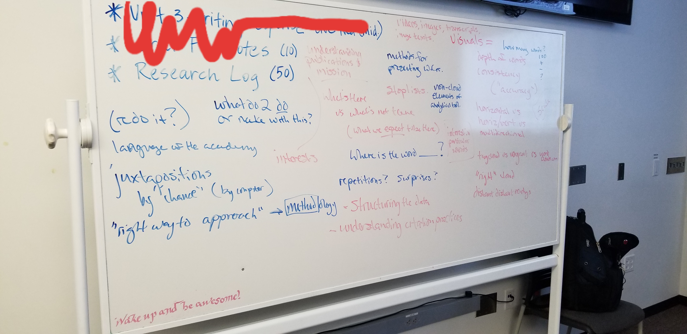
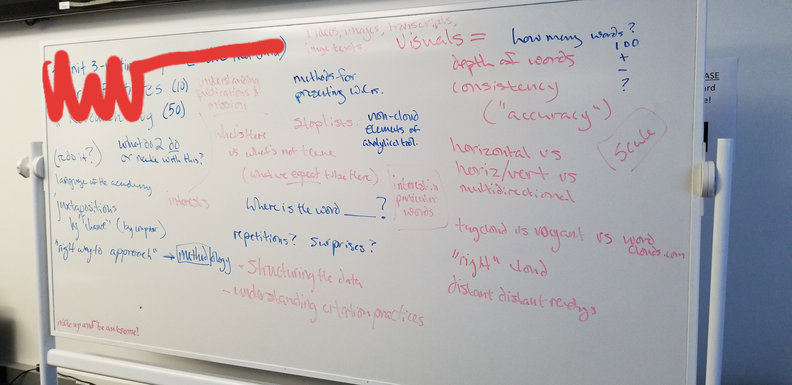

# praxis idea:

I have, as you know, been thinking about the "What do we do with this?" question that came with your really interesting distant reading results and discussion. On Wednesday, I hinted at collaborating to compose a scholarly webtext for publication in a multimodal scholarly journal (my prime choice would be Kairos, http://kairos.technorhetoric.net/). Though this sounds like a lot to do in the last half of the semester, I am confident that with the number of hands and brains we have on deck and by shoving some planned items in the course around (or to the side) we would be able to pull this off without too much trouble or unrealistic extra work.

Essentially, what I'm suggesting is to remove the upcoming rhetorical analysis  and annotated bibliography projects entirely--much of the intellectual and practical work we would do in those projects will translate well into work for the kind of webtext we would collaborate on.

As a result of our discussions, I've become interesting in engaging with Mueller's (and others') assertion that word clouds and distant reading are a good form of novitiate word-watching, useful for graduate students entering the field to get a kind of "network sense" of the discipline and their relationship to it. We would work through Brooke (his rhetorical ecology of practice will be a useful framework) and Mueller (again, the motivating theory of network sense and distant reading as methodology) and other scholarship. We could (for example) put together versions or iterations of your word clouds, inviting reflection and proairetic perspectives on reading-forward and pattern-sensing. Thus reading digital rhetoric via digital rhetoric a la Eyman and others. In the end, we could compose a hypertextual, multimodal scholarly reflection that describes and assesses what we saw, what we read, how we followed up on it, and how we did it all. Certainly galleries or instances of word clouds at various levels of scalability would be a major piece. Doing this would mean a bit of literature review, some methodical re-fabrication of your word clouds, and figuring out how to situate our activity in the conversations I've mentioned above. All chores that are VERY worthy of doing in a class of this kind--and would really emphasize the workshop nature of the course.

I do think this could be a useful praxis-oriented piece for the field of digital rhetoric. It might make for a good "Praxis" section article in Kairos. Here's the description of what these kinds of pieces can do from the journal's site:

>Praxis: Peer-reviewed investigations into the intersections of rhetoric, technology, and pedagogy with an emphasis on what happens in the writing/rhetoric classroom and why. Webtexts—case studies, discussions of networked/new media composing, or other formats—should showcase how writing is informed by emerging technologies foregrounding practical aspects (i.e., how would one use the technique being described? Who might benefit from following the author's approach and why?) while providing a theoretical grounding. Because the Praxis section typically features actual classroom research, authors are encouraged to provide appropriate, scholarly use of video, audio, image, or other digital media examples of the techniques described. (http://kairos.technorhetoric.net/submissions.html )

I would be inordinately happy to coauthor (or at least to try) such a piece with ya'll. Please think on it, discuss amongst yourselves, and email me with questions, ideas, or comments. Since we're meeting for the Graduate Speaker Series next week, we could briefly chat afterwards to follow up on whatever email or other conversations spring from here.

*Caption: One view of the whiteboard from October 9: Student notes on what we see, how we made sense of this as a method of scholarly reading and play, and what worth or interest(s) we potentially saw in the activity.*

*Caption: A second view of the whiteboard from October 9: Student notes on what we see, how we made sense of this as a method of scholarly reading and play, how we read, and methodological struggles as we worked on the activity.*
