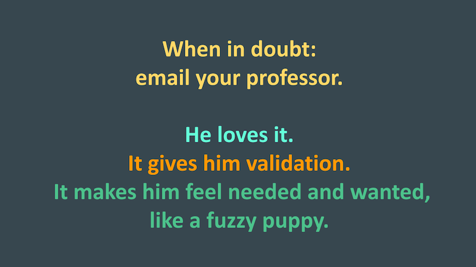

[ENGL 5362, Fall 2023](index.html)

# Project 2: Annotated bibliography

**Purpose of this assignment**

The purpose of an annotated bibliography is to learn about a particular topic by critically reviewing the literature and providing an overview of the main issues, arguments, and research within a particular area or subfield. Related to the annotated bibliography is the literature review section of a scholarly study, which reviews what is known about the topic as a way to set up the research project and findings that will be shared. The two genres are similar, but not the same. In this project you will get a taste of both, but we will lean more heavily on the annotated bibliography.  

## Your assignment

Find some **local digital writing practice and/or culture that could be explored or examined through the theories and frameworks we’ve studied**. Collect at least five scholarly sources on the subject in addition to readings assigned for class and <mark>compose an annotated bibliography of at least ten sources that reviews the scholarly conversation</mark>. You will also <mark>compose a synthesizing introduction that summarizes and engages with that conversation</mark>. This project is intended to lay groundwork for Project 3. 

- Annotated bibliography of 10 sources. Limit of 5 from class readings. Annotations should be around 100 words.
- Synthesizing introduction should be APA format, double-spaced, minimum 2 pages.

The sources you collect should be, like our course readings, firmly within the disciplinary boundaries of writing studies writ large: digital rhetoric, rhetoric and composition, technical communication, computers and writing, and creative writing. I will help orient you to journals and other relevant publications in those subfields. 

Critical to your success is **localization of your topic or question**-—making it of our shared region in character and quality. You should study something that happens (or happened) here. We can be a bit broad with that, but I will strongly encourage you to approach your study as a way to speak to things from the perspective of TAMU-CC, Corpus Christi, Nueces County, Coastal Bend, South Texas, Texas. Boundaries of “the local” in a digital framework are by nature transgressive and trespassable—and geosocial localization is not the only way to frame “local,’ but in general you should begin by orienting your inquiry towards things that have a firm foothold “here” (wherever that is). Your symthesizing introduction will do most of the localizing work by stating and describing the practice or culture you’re interested in and that motivates or orients your approach to topics and sources in your annotated bibliography. 

### Guidance on preparing annotated bibliographies

- [Purdue OWL, Annotated Bibliography Samples](https://owl.purdue.edu/owl/general_writing/common_writing_assignments/annotated_bibliographies/annotated_bibliography_samples.html)
- [TAMUCC, McNair Scholars, Annotated Bibliographies vs Literature Reviews](https://guides.library.tamucc.edu/c.php?g=1300160&p=9552942)
- [APA Guidelines for References](https://apastyle.apa.org/style-grammar-guidelines/references)
    - see especially [Basic Principles of Reference List Entries](https://apastyle.apa.org/style-grammar-guidelines/references/basic-principles) and the related handouts with examples and abbreviated style guidelines.
- **Example Annotated Bibliographies**
    - Cox, M. B. & Faris, M. J. (2015). An annotated bibliography of LGBTQ rhetorics. *Present Tense 4*(2) [http://www.presenttensejournal.org/volume-4/an-annotated-bibliography-of-lgbtq-rhetorics/](http://www.presenttensejournal.org/volume-4/an-annotated-bibliography-of-lgbtq-rhetorics/)
    - Melfi, A., Khoury, N., & Graban, T. S. (2021). An annotated bibliography of global and non-Western rhetorics; Sources for comparative rhetorical studies. *Present Tense, Bibliographies 9. [https://www.presenttensejournal.org/bibliographies/an-annotated-bibliography-of-global-and-non-western-rhetorics-sources-for-comparative-rhetorical-studies/](https://www.presenttensejournal.org/bibliographies/an-annotated-bibliography-of-global-and-non-western-rhetorics-sources-for-comparative-rhetorical-studies/)
    - CCCC Committee on Best Practices in Online Writing Instruction. (2009). *Annotated bibliography, 1980-2008* [https://www.owicommunity.org/owi--distance-education-resources.html](https://www.owicommunity.org/uploads/5/2/3/5/52350423/owiannotatedbib.pdf)
    - WPA/CompPile Research Bibliographies [https://wac.colostate.edu/comppile/wpa/](https://wac.colostate.edu/comppile/wpa/)

### Guiding questions

So, what are some ways you might appropriately **localize** our guiding questions of the course or the variety of topics we'll read about and discuss? 

- How can we characterize relationships between form and content? 
- What relationships do writers, institutions, and audiences have to texts in circulation, particularly on social platforms and the web? 
- How does discourse circulate to achieve goals? Whose goals? 
- What happens when discourse is on the go? 
- What roles do templates, interfaces, platforms, and other technologies play in digital composition? 
- How can we—or can we in the first place—anticipate updates, circulation, and delivery as components of rhetorical situations and ecologies? 
- How might we use rhetorical theory to inform practice, advocacy, and critique in a digitally circulating world? 

### Course topics

- IPI template rhetoric 
- Meme rhetorics 
- Textual timing, Textual attention, Textual management 
- Rhetorical velocity 
- Interfaces and ideology 
- Public rhetoric/writing 
- Digital authorship 
- (new) Materialism(s) 
- Open Access 
- Accessibility 
- Augmented reality 
- Writing with Generative AIs 
- Content management, editing, content professions 
- Mobile writing 
- Materiality and digital writing 
- Memory, Delivery, Circulation 
- Aggression and social media 
- Ethics and addressing digital aggression 
- Rhetoric and outrage 
- How writers respond to and learn from audience reception 
- _____? 
- _____? 

I can say with 99% certainty that you will not find sources on these topics that directly, explicitly treat your local issue. Part of the challenge in building a literature review or annotated bibliography is that you are setting up a conceptual framework or theoretical foundation of ideas that you would then be able to use to talk about the local digital writing practice/culture you want to study. 

For example, if you’re interested in the popularity and uptake of posts in r/corpus or “Corpus Christi Drivers being Corpus Christi Drivers” on Facebook, you of course should not expect to find discussions of either group in the scholarship. You would instead want to read articles that treat rhetorical circulation and subreddits to get a sense of scholars’ ideas, questions, and findings to give context, significance, and direction to your own line of inquiry.  

<!--- 

Writers of all abilities and experience levels can benefit from appointments with a Writing Consultant in the <a href="http://casa.tamucc.edu/wc.php" >CASA Writing Center</a>. Formatting, spelling, and grammatical errors can make your documents difficult to read and understand or can undermine your content.

 --->

 This work is licensed under a <a rel="license" href="http://creativecommons.org/licenses/by-nc-sa/4.0/">Creative Commons Attribution-NonCommercial-ShareAlike 4.0 International License</a>.
