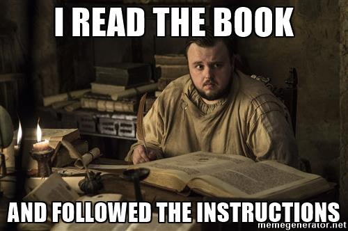

# Notes and Overview for Week 01

[ENGL 5362, Fall 2023](/5362/calendar.html)

*Important: No assignments or course documents, including the syllabus, should be considered to be in their final form until the first week of class begins.*

Each week, I'll post notes and an overview of the week's content (just like this document). These docs will detail specific readings, assignments, and due dates for each week. In general, when people email me about being confused about what to do that week, I will ask them: "Did you check the overview?" Always check these weekly documents first!
<figure>
<figcaption><i>Figure 1: Always read the instructions</i></figcaption>
</figure>

## Agenda
1. Introduce each other and compose ourselves
2. Look at the syllabus and [Blackboard](https://bb9.tamucc.edu) ever so briefly
3. Talk about what we know already about rhetoric
4. Look at the [Online presence project](/5362/project-1.md)
5. Talk about what it means to "Read like a grad student" in all of its deceptive simplicity

## Form/Content and Rhetoric 
*Assigned readings can always be found on Blackboard. Addional resources should be there, and if not are accessible through our Library)*

You were to have read the following today:
- Richard Lanham (1989), "The Electronic Word: Literary Study and the Digital Revolution" 
- Lisa Dush (2015), "When Writing Becomes Content"
- James Porter (2009), "Recovering Delivery for Digital Rhetoric"
- Beatrice Warde (1932), "The Crystal Goblet"

Works I'll mention or that might help with additional background on today's topics:
- Roland Barthes (1964), "Rhetoric of the Image"
- Douglas Eyman (2015), *Digital Rhetoric: Theory, Method, Practice*
- James P. Zappen (2005), "Digital Rhetoric: An Integrated Theory"
- Kathleen Blake Yancey (2004), "Made Not Only in Words: Composition in a New Key"
- Johndan Johnson-Eilola (2012), "[Polymorphous Possibility and Texts](https://kairos.technorhetoric.net/16.3/topoi/johnson-eilola/)"

## Notes/Questions for readings

### Lanham, "The Electronic Word: Literary Study and the Digital Revolution"
- of note is Lanham's unbridled optimism and revolutionary rhetoric (he's more than a a bit of a determinist, if a joyful one)
- pub in the 80s, well before the internet (which was around, let's not get crazy) would even more upset the applecart--this is the age of the CD-ROM, the rise of the personal computer
- but how much of this applies today?
- key bits and phrases
    - digitization desubstantiating
    - unselfconscious transparency / basic stylistic decorum / the fixed text (p. 266)
        - related concepts from Bolter & Grusin (2000), *Remediation*: [remediation, immediacy, mediation, hypermediacy](https://kairos.technorhetoric.net/6.1/reviews/blakesley/glossary.html#remediation)
        - see Warde (1932) here, "The Crystal Goblet" - "no cloud must come between your eyes and the fiery heart of the liquid." 
            - Warde is the touchstone for concepts of clarity (in typography and design) and straightforward presentation of content.
            - what is/should be the relation of thought to form?
            - Ironically (?) many of Warde's early publications in typography were published under the pseudonym Paul Beaujon, who she imagined as "a man of long grey beard, four grandchildren, a great interest in antique furniture and a rather vague address in Montparnasse" (thanks Wikipedia!)
    - creator-controlled and reader-controlled; the interactive reader of the electronic word (p. 268)
    - the textual surface has become permanently bistable; AT / THROUGH oscillation (oscillatio) (p. 267)
        - see unselfconscious/self-conscious bistable decorum (p. 276)
        - the Greek philosophers championed the first view, the Sophists the second, and we have been debating the issue ever since (p. 277)
    - **what business are we really in? (p. 270; 285ff)**
    - digitization both desubstantiates a work of art and subjects it to perpetual immanent metaphorphosis from one sense dimension to another (p. 273)
    - the Ovidian metamorphosis looks backward as well as forward (p. 275)
    - Rhetoric... a general theory for [all the arts](https://www.sas.upenn.edu/~traister/lanham.html) (p. 278)
    - fundamental questions to rethink
        - copyright and the struggle between freedom to publish and profit and state control
        - profits and duplication/distribution?
        - intellectual property and final cut and fair use?
        - traditional (academic) merit badges and value of text/delivery/system?
        - what publication means
        - tranditional figure of humanist as Luddite vs computer as A Possible Friend
        - new students
        - what does "Majoring in English" mean?
        - the rhetorical [paideia](https://en.wikipedia.org/wiki/Paideia) (p. 286)
        - Western Self and allowing neither Arnoldian Sincerity nor Deconstructive Despair
    - "If we decide once again to view technology with a hostile eye, this time we may find ourselves making the pianos while someone else makes the music." (p. 288)

### Dush, "When Writing Becomes Content"
- four characteristics of content. content is: 
    - **conditional**: fluidity in what shape it may take and where it may travel, intdeterminacy in terms of who uses, for what, and how valued
    - **computable**: subject to algorithmic manipulation (mine, rank, process, match, reconfigure, redistribute,)(Manovich (2001) *Language of New Media* principles: numerical representation, modularity, automation, variability, cultural transcoding)
    - **networked**: hooked into networks of human and nonhuman actors, mutliple, discursive, material, (unknowable?)
    - **commodified**: will be/"is always already" visible to market evaluation (use value & exchange value--value is when text is in circulation)
- what does "content" highlight about composing that "digital writing" or "multimodal" do not?
    - "text transformed into data"; again see Manovich and Dush's four characteristics
    - highlights the fundamental social and material practice/nature of writing (studies)
- why is "content" (potentially) a necessary metaphor to pair with "writing"
    - metaphors are not neutral, and can bundle to foreclose possibilities (literacy--tech literacy--multiliteracy--computer literacy--digital literacy)
    - content metaphor helpfully focuses us beyond the designed document
    - see table of oppositions, Figure 2 p. 182; the entities, contexts, practices, characterizations of content and writing are.... different, some  harder to reconcile
    - **what is the danger of missing the writing-as-content metaphor?**
    - **what are potential consequences of writing-as-content realities?**
- how is "content" changing professions/work/fields? opportunities? responsibilities? values? 
    - comes out of TC and (digital) marketing/publishing
    - can writing-as-a-craft weather commidification? how is this bound up with gig economy, efficiency/ease/profit logics of high capitalism, and always-on edge workplaces?
    - content management & content management systems, content professions, 
    - structured authoring, single-sourcing, asset management, strict separation of form and content, content repurposing
- becoming: 1) growth, merging, old thing *is also* the new thing. 2) transformation (metamorphosis?), old thing *has now become* a new thing

<mark>(reading note--the level one of this outline above are just my notes/transformations of the intro--I could now read the full article and sit down and try to answer the questions or flesh out notes in summary, as I have here in the nested parts of the list)</mark>

### Porter, "Recovering Delivery for Digital Rhetoric"

- 
# For Next Time

## Journal entry for week 2
More detail forthcoming, but I will ask you to write a short (300+ words) digital literacy autobiography for your next journal entry. 

Write about a technology that has affected your skills, abilities, and/or experiences as a writer and/or as a reader. This is not a research paper. This assignment is an autobiography—-a piece in which you tell a story about yourself as a writer and/or as a reader, specifically a story about how technology has changed your approaches to writing or to reading. Don't feel like you have to tell a full autobiographical narrative; this could just as well be a scene, a sketch, or a series of brief anecdotes.

You might write about:
- what you have learned about grammar from playing video games
- how composing on a computer has changed your approaches to writing
- how designing graphics on a computer has changed your ideas about what composing is and how words and images work together
- how you don’t consider texting to be writing

*These are only examples—choose any narrative thread you wish to unfold your autobiography.*

Potentially helpful invention points:
- What were your earliest experiences with a writing technology? With a digital writing technology? What do you remember about them? How did you use them? What did you write/create?
- How has your writing changed with or in relationship to digital writing technologies?
- What does your current digital writing environment look like? The physical environment—computer, desk, surrounding area; the virtual environment—the desktop, screens, and interfaces you write within? How does this environment reflect your digital writing practices?
- What digital tools do you currently use to write, compose, and/or create? What sorts of “texts” do you produce? How are the texts you produce different because they were created digitally?
- What would your writing be like if you did not have access to digital writing tools?

## To Read for Sept 7 (Digiality, Interfaces, Ideologies)

Required:
- Selfe & Selfe (1994), The Politics of the Interface 
- Boyle, Brown & Ceraso (2018), The Digital: Rhetoric Behind and Beyond the Screen 

Any two of: 
- Carnegie (2009), The Interface as Exordium 
- Sano-Francini (2018), Designing Outrage, Programming Discord 
- Jones (2021), Circulatory Interfaces 

Possibly:
- Haas (2007), Wampum as Hypertext: An American Indian Intellectual Tradition of Multimedia Theory and Practice