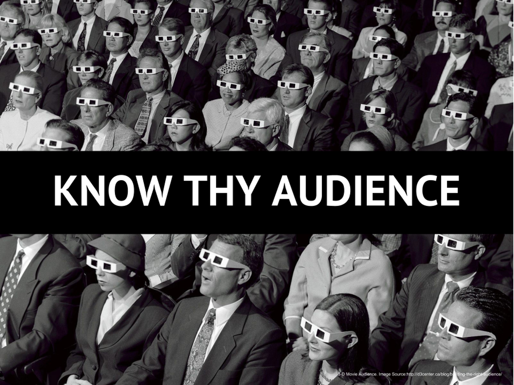

# Notes and Overview for Week 3

[ENGL 5362, Fall 2023](/5362/calendar.html)

*Important: No assignments or course documents, including the syllabus, should be considered to be in their final form until the first week of class begins.*

# Agenda
1. Compose ourselves
4. Followup Qs and As [Annotated bibliography project](5362/project-2)
5. Using library multisearch and Google Scholar together to chase those rabbits
3. Talk about this week's readings: theories of audience in rhetoric and writing studies 

## The actual library

## Audience(s)
*Assigned readings can always be found on Blackboard. Addional resources should be there, and if not are accessible through our Library)*

Required:
- Ede & Lunsford (1984), Audience Addressed/Audience Invoked 
- Phelps (1990), Audience and Authorship: The Disappearing Boundary 
- Gallagher (2020), The Ethics of Writing for Algorithmic Audiences 

Optional if you really want to go deep:
- Beck (2017), Sustaining critical literacies in the digital information age: The rhetoric of sharing, prosumerism, and digital algorithmic surveillance. In [Walls and Vie, *Social writing/Social media*](https://wac.colostate.edu/books/perspectives/social/)
- Blakeslee (2023), Audience. In [Yu and Buehl, *Keywords in TPC*](https://wac.colostate.edu/books/tpc/tpc/)
- Eberly (1999), From  Writers, Audiences, and Communities to Publics: Writing  Classrooms as Protopublic Spaces
- Head (2016), Teaching grounded audiences: Burke’s identification in Facebook and Composition
- Johnson (1997), Audience involved: Toward a participatory model of writing
- Ong (1975), The Writer's Audience is Always a Fiction

## Continued conversations about interfaces
- how do interfaces mean? 
- how do we (learn to) read interfaces critically?

## Notes and Questions towards understanding audience in rhetoric and writing studies

- What does "consider your audience" mean? Why is that weird (both weird weird and obvious weird) for RWS theory?
- How is composition's root in classical rhetorical theory/practice part of the problem?
- Why do social media companies want you to have the perfect successful profile? 
- How are audiences agents in discourse?
- That is, how does audience (and its variouis refiguring in theory) challenge the role/power of writers?
- How can we best define the audience of a written discourse?
- What does it mean to address an audiene?
- To what degree should teachers stress audience in their assignments?
- What is the best way to help students recognize the significance of audience?

The "hegemony of authority" in RWS.
- participatory audiences
- collaboration, circulation, delivery
- users
- consumers, prosumers (**prosumer**--consumers performing the tasks of specialized laborers; DIY ethos and outsourcing of labor--the rhetoric of sharing in the early 00s with the birth of Web 2.0 "positioned prosuemrism as a viable economic model for digital commerce" (Beck, 2017)
- fans and the hegemony of headcanon
- publics
- online communities
- trolls
- lurkers
- algorithms/machines/computers
- nonhuman/nonliving actors

The problem of teaching audience in composition classrooms (classical, modern, and contemporary audiences)
- audience addressed
- audience invoked
- audience involved (TC perspective on audiences as real and literally worked with to resolve exigency--"acts of collaboration that involve the audience directly in the discourse production process" (Johnson p. 363))
- algorithmic audiences

Preview for next week; theory of rhetorical velocity help us to usefully complicate audience as agent--more on that next week! 

dialogic interaction <-----> social nature of communication

### Questions from you-all
1.  Are they addressing the idea of multidirectionality in "Audience and Authorship: The Disappearing Boundary"? That's how I read it.
2.  This isn't a question about the readings, so much as a pondering question that I have in gneral about the topics covered. Why don't we offer more psychology classes for English majors? A lot of the stuff we do/read merges with the field, and we're not really encouraged to devle into it.
3. Ede and Lunsford: If invoking the audience still requires (to some extent) addressing the audience, why bother invoking the audience?
3. Phelps: The criticism given to invoking an audience through a text is the fact that the writer is targeting an audience that does not physically exist (unlike verbal discourse, in which the speaker ideally can receive immediate feedback from the audience.) Are there specific scenarios in which verbal discourse could be equally ineffective?
3. Gallagher: Does formatting and organizing a document to make it more appealing for an algorithm fall within the realm of addressing an audience?
1. Although writers must rely on their own vision according to Lunsford but shouldn't writers also know their audience and write accordingly?
2. Discuss Mitchell and Taylor believe an addressed audience gives the audience more control than the writer and audience invoked overemphasizing the power of the writer and undervaluing that of the reader.
3. Discuss more about the interface of social media vs. regular media; newspaper, books, TV.

### Ede & Lunsford (1984), Audience Addressed/Audience Invoked

(how do writers conceptualize audience as they write?)
(legacy of rhetoric's fundamental theories grown out of speaking situations)

**audience addressed**--"the cooncrete reality of the writer's audience"; knowledge of attitudes, beliefs, and expectations is possible and essential (audience may still be real or imagined by writer).

Weaknesses: 
- overemphsasizes/narrow focus on modifying work with reference to audience / pandering to the crowd? (what is the writer's responsibility to the subject?)
- oversimplified view of language (non-interactive views of discourse as meaning-making)

**audience invoked**--"a construction of the writer, a 'created fiction' (writer provides cues for reader that define the role they wish the reader to adopt in response to the text)

Weaknesses:
- overemphasizes distinctions between speech and writing and undervaluing insights of discourse theorists
- overemphasizes power of the writer, undervalues power of the reader

**what then are we left with? for conceptualizing audience**
- "complex series of obligations, resources, needs, and constraints embodied in the writer's concept of audience" (p. 165)
- illustration of the "constantly shifting complex of meanings" from their own writing experience, good array of how audience shifts meanings even throughout a single piece of writing (p. 167)
    - audience as seminar group, as self, as collaborator, as editor, as readers of CCCC and CCCC and roles they defined, audience of conversants
    - audience as **all those whose image, ideas, or actions influence a writer during the procecss of composition**
        - notice that Ede & Lunsford are mostly concerned with audience in invention, though their illustration points richly to audience in circulation/delivery
    - audience as **so overdetermined** that it can best (only?) be specified in situations/cases
    
    - **fully elaborated model of audience balances creativity of the writer with the creativity of the reader and wide and shifting range of roles**(p. 169)

### Phelps (1990), Audience and Authorship: The Disappearing Boundary

concept of "dialogic interaction" between writer and reader vs (?) social nature of communication

distinguish audience from writer, text, and context--i.e. defiining discrete interacting elements of discourse

social dimension of authorship (audience as the 'other' within text and self)

dialogic theories complete composing with uptake or interpretation--negotiating meaning.  vs epistemic, meaning-making rhetoric

reconsiderations of audience that acknowledge situation and context as extensions of audience don't go far enough -- need a more fully contextualized, polyphonic, contentious model of transactionality that encompasses multiple participantes and voices along with situation, setting, institutions, and language itself, not maintaining firm boundaries between self and other (p. 156)

defines audience as **"a set of functional roles, perspectives, and relationships that can ocnstrain or influence authorial choice (during composing) and can also interact in subsequent readings and uses of a text by others"** (note inclusion of audience as agent/participant)

assumptions implicit in discussions of dialogic interaction
1. textual transactions conceptualized in an ideal image of a dyad, subjects displaced in time and space, taking up virtual selves and virtual others to engage in the text world
    - mechanistic view of reality as reducible to discrete components, not sufficiently rich
2. writer/reader interaction is a fixed chronology
    - fails to account for simultaneity, recursion, interdependence/blending of social acts
3. writing-reading interaction is relatively short, time-limited, definedby writing and reading episodes, and largely cognitive
    - too locked in to writing "event" and reading "event" as bounded; not adequately intertextual (texts are codependent and interpenetrated) -- gets out to far implication of authorship no longer being taken for granted--we are "comprehensively invaded and possessed by the ohter" (p. 162)

what a concept of authorhsip needs to explain:
- we experience ourselves as authors, the source/origin of language/ideas we write
- authors resist the social in forming their texts; intentions and choices in the face of readers/critics/other voices--we are not lyres passively played by ideology
- authorship as taking responsibility (legally and morally) for what is said--authorship is consequential

Bakhtin, utterance

"encourage and constrain a pluralist concept of audience by locating all variants in relation to addressivity, defined (with respect to utterances) as something like 'the willed social orientation of a verbal performance toward the other.'" (P. 170-171)

virtual and actual participants; origin and destination

### Gallagher (2020), The Ethics of Writing for Algorithmic Audiences

the "nonhuman turn" in writing studies/humanities; Gallagher's discussion of algorithms is not to critique them as monsters, but to see the intersection of the technical and the social, the human and nonhuman.

Unboxing vs critique?

**algroithm**: exectuable procedures that are investigated, documented, and researched; input/output procedures with a terminating endpoint that yield a result (p. 2)

algorithms are "machinations of human beings' intentions and the equations designed to achieve those intentions" (p. 2)

**Not only tools we use to communicate but audiences to communicate *with***

For example, [YouTubers talk a lot about](https://www.creativeculturepod.com/) unlocking the secret of "the algorithm," or being frustrated with the algorithm, or having to change what they do in reaction to the algorithm (for exmaple, the role of video length, use of shorts, style of thumbnails, importance of titling), but the algorithm isn't about videos, it's about what viewers do and how they behave (what they watch, for how long, their interactions, their profile; see more at [YT Help](https://support.google.com/youtube/answer/11914225?visit_id=638120962694991152-283355420&p=video_discovery_tips&rd=1)) 

<blockquote>I propose understanding algorithmic audiences as fluid objects that are both human and nonhuman. Algorithms represent human audiences but are simultaneously apart from these audiences. On the one hand, if digital writers decide that human descingers and programmers are their audiences, then the algorithm might be an audience. On the other hand, if digital writers percieve that an algorithm makes decisions autonomously--even if those decisions were originally programmed--then digital writers may percieve thosse objects or procedures as audiences. (p. 3)</blockquote>

-- that is, YouTubers are a great example of the complicated conceptual work of "who's your audience"--YT says your viewers are the only audience you need to worry about, but YTers reinforce the idea that the algorithm/YouTube is the audience they need to satisfy and please -- 

**"algorithmic audiences curate us"** (p. 4)

considering pandering and *ad populum*; why are algorithms opaque/obfuscated?

]

## For Next Time

### Journal entry for week 4
Run an Google image search for "rhetorical situation"--you will find a *multitude* of visualizations. Triangles, stars, bubbles, process diagrams, and more. Select one visual representation  of the rhetorical situation that you think is particularly apt and one you think is particularly limited, focusing more on how well the visual captures the concept rather than the technical skill of the designer.

In your journal entry, briefly discuss your two visual representations of the rhetorical situation--include embedded or integrated copies of your selected visuals in your post, so we can see what you're talking about. Use one of the following tools to create your own visualization of the rhetorical situation and post it with your journal entry:
- [draw.io](https://app.diagrams.net/)
- [LucidChart](https://www.lucidchart.com/pages)
- [Canva](https://www.canva.com/graphs/diagrams/)
- PowerPoint (export your slide as a .png file--I use this all the time to create diagrams)
- Other tools you know about that I don't?

As you're exporting your image files, [consider the differences between and relative benefits of .png and .svg file formats](https://www.adobe.com/creativecloud/file-types/image/comparison/png-vs-svg.html#:~:text=While%20PNGs%20are%20capable%20of,size%20without%20losing%20their%20resolution.).

### To Read for Sept 21 (Situations, Ecologies, Velocity)

Required:
- Grant-Davie (1997), Rhetorical Situations and their Constituents 
- [Ridolfo & DeVoss (2009), Composing for Recomposition](https://kairos.technorhetoric.net/13.2/topoi/ridolfo_devoss/) 
- Ehrenfeld (2020), Rhetoric’s Ecological Turn 
- Gallagher (2015), The Rhetorical Template  
- Carlson (2019), Online Petitions and Inventing for Circulation 

We will also have a short APA Crash Course for the uninitated.