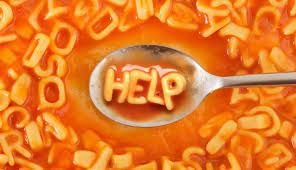

# Notes and Overview for Week 5

[ENGL 5362, Fall 2023](/5362/calendar.html)

## Agenda
1. Compose ourselves
4. Workshop on the [Annotated bibliography project](5362/project-2)
5. Synthesizing Intros and Alphabet Soup Lit Reviews
3. Finish up with rhetorical velocity 

**[Andrews' Modified APA 7 Stylesheet](media/apa-modified.pdf)**
See also:
- [APA Guidelines for References](https://apastyle.apa.org/style-grammar-guidelines/references)
- [Basic Principles of Reference List Entries](https://apastyle.apa.org/style-grammar-guidelines/references/basic-principles) and the related handouts with examples and abbreviated style guidelines.

## On the Problem of Alphabet Soup

 

In an alphabet soup lit review, multiple sentences start with names and dates of authors the reader has never heard of and doesn't need to remember. Sometimes three sentences are stuck together to form a paragraph, and there is no topic sentence or summary sentence in it. It's "he said this and she said that and he said this and then in 2007 she said that." These names and dates fly past the reader and he or she can’t make sense of the overall argument. It lacks structure. I call them “alphabet soup” lit reviews.

The problem? This style of lit review frequently lacks **synthesis** (i.e., you haven't explained the overall picture of what all this individual stuff builds up to). Your synthesizing intro should guide us through **ideas**, not sources.

Red flag for alphabet soup: all sentences/paragraphs start with an author's name.

How to un-alphabet soup it?
1. If you're starting with someone truly famous, or if that one person is central to the entire work, you can open the sentence author-first.
2. Revise all other author-first sentences to put the content in the subject. (see examples in handout)
3. Give each paragraph a topic sentence.
4. Check for transitions--front of paragraph, between points in paragraph.
5. Check for forecasting statements at the beginninog of each section.
6. Section titles (if they appear) should be descriptive.

<mark>Activity</mark>: Write each author's study on an index card. How would you lay out your cards in groups? Do you use headings, forecasting statements, topic statements, transitions to show those groups? 

## V=d/t

*Assigned readings can always be found on Blackboard. Addional resources should be there, and if not are accessible through our Library)*

Need to finish up with:
- Grant-Davie (1997), Rhetorical Situations and their Constituents 
- [Ridolfo & DeVoss (2009), Composing for Recomposition](https://kairos.technorhetoric.net/13.2/topoi/ridolfo_devoss/) 
- Ehrenfeld (2020), Rhetoric’s Ecological Turn 
- Gallagher (2015), The Rhetorical Template  

Required for today:
- First half of Gallagher (2019), *Update Culture*
- Arola (2010), The Rise of The Template 
- Dilger (2010), Beyond Star Flashes  

### Notes and Questions towards understanding rhetorical situations and rhetorical velocity
Need to finish up with thinking about rhetorical velocity and forward into rhetorical templates

<iframe src="https://docs.google.com/presentation/d/e/2PACX-1vTxSC1TgM1MdTt2mKhsdeMHJ9arJQV7HIK6wm5cKCTKFx-I1zcl6YXNX88F2dVv76MMxfRX94YFNv8x/embed?start=false&loop=false&delayms=3000" frameborder="0" width="960" height="569" allowfullscreen="true" mozallowfullscreen="true" webkitallowfullscreen="true"></iframe>

### Notes and Questions towards understanding Kairos, Chronos, and Digital Writing -- What are writers doing as their writing is in circulation? 
- as digital writing circulates, it does not do so statically or without making a claim on those who initially write it (4)
- fundamental shift in the analytic and inventive focus from an end product of writing to the emergent responses to online commenters (4)

- we should examine not just the end product, but how processes and stratgies change over the course of time as they experienc etheir audience's reactions and responses (after composed, during delivery) -- writing during circulation (which is different from print economies of writing)

- online audiences pose new topoi and change doxa that beg for inventive possibilities and interactions

"circulatory writing processes" not just "texts in circulation" or "results of circulation"

writers attend to afterlife in "update culture" through stratiegies:
- textual timing
- textual attention
- textual management

**Interactive and Participatory Internet Templates (IPI)**
- templates as structures that provide *decorum* (also habits, expectations)
- templates "prefigure the writer/audience relationship" (p. 7)

#### Arola - Rise of the Template, the Fall of Design; Dilger - Beyond Star Flashes
- Arola is “troubled by Web 2.0’s tendency to render form standardized and invisible” (4), and argues that composition teachers engaging iwth Web 2.0 need to attend to the work of design. Though we may not have known much about how to code and design our own web pages before, we know less now. And the same is true with students: “it is important to keep in mind that just because technology is seamlessly woven into their lives does not mean that they are technologically savvy” (5), and the more seamless and transparent the technology is, the less likely we are to know much of anything about it.
- In web 2.0 (especially with blogs and social networks) composing is “posting” and quite separated from intentional design choices (6). This speaks to the larger concern (within composition studies and web design) of the form/content split:
    - “The move toward multimodal composition has worked to undo the word/image split and encouraged a pedagogy that engages with the rhetorical impact of not just words, but images, design, and sound. In spite of what seems to be pedagogical attention toward modes beyond the alphabetic, we need to acknowledge that in practice Net Generation students, as well as ourselves, are discouraged inWeb 2.0 from creating designs.We are certainly posting information, but this information has become “content” placed in a “form” beyond the user’s control. I worry that unless we, along with our students, engage in analysis and discussions of online design, in the absence of creating designs—our alienation from “form” or “presentation”—we will further render the template invisible.
- THat is, if interfaces are rhetorical, when we lose the ability to design--or even see them as designed--we lose agency as consumers and creators in the world of templates as we fail to see how design shapes our interaction. The issue is not only about production, but also about ideology and identity.

WYSIWYG Problems: How do interfaces afford or enable some forms of rhetorical action at the same time that they foreclose others? 
-what is the rhetoric of wysiwyg?
-what is the value of wysiwyg?
-what are the limitations of wysiwyg?
-how do wysiwyg interfaces enable rhetorical action? how do they foreclose them?

Where do we sit on the continuum of “in praise of difficulty” (i.e. expertise and learning) or low-bar entry (i.e. ease for learners). Should learning be easy or hard? 

On the one side, we have the “material-cultural challenges of circulation” as a constraint, on the other, we have the notion that “literacy” is about expertise with language and culture.

Dilger: What are the different ways people can be "writers" on Web 2.0?

### Your Questions

1. What are the pros and cons of template driven design since Arola argued the downside?
2. How is Web 2.0 interfaces shaping our interactions and ourselves?
3. How can we re-engage design if Web 2.0 takes it away from us?
4. Is Web 2.0 really just a form of ideology?
5. Is Blackboard really offering courseware that leverages function to create network effects and empower end users? 
- "Update Culture" indicates that digital content is constantly amended and updated, even once ciculation has begun (it could even be argued that Update Culture is a necessity for circulation, as made evident by Ridolfo and DeVoss in their section on Remixing.) That being said, is it possible that Update Culture could cause a piece of conent to change so drastically over time that it alters the message that the author had originally intended?
- Gallagher discusses the concepts of Kairos and Chronos, which he defines (in simple terms) as when to post content, and how long that content will circulate. He uses Reddit as an example, and uses case studies in which Redditors take into consideration when Americans are most likely to be browsing Reddit. With interfaces such as Facebook and Instagram, in which users receive alerts when a page they follow posts new content, could it be argued that the "Kairos and Chronos" considerations have varying levels of importance based on the interface that is being used to distribute content?
- WYSIWYG word processing editors do not serve as an immediate form of user-to-user communication in the same way that IPI templates do. While content created with these types of word processors can be taken to an IPI template, could it be argued that WYSIWYG word processing editors discourage circulation?

## For Next Time
For the week of October 5 (Week 06) Dr. Andrews will be traveling to the CBE Exchange Conference in FL. Turn in An Bibs by the end of week, and please don't hesitate to email me with questions while I'm gone.

The Next Time we meet will be Week 07. You should finish *Update Culture* and be prepared to discuss it on October 12.

In the three weeks following that, we'll be reading *Circulation, Writing, Rhetoric* together, which is available online through the library. We'll be shifting out of big Theory mode and into a more practical, applied part of our exploration of digital rhetoric. Rather than everyone slogging through all of the chapters, I will ask you to pick any two chapters from each part of the book (more on that later) to read and prepare some "Talking Points" about (these will count as your Reading Journal entries). I'll provide more details on that during class on the 12th.

We will also be turning our attention to the [digital project](https://cdmandrews.github.io/5362/project-3), and I want to be sure to carve out plenty of class time to discuss and workshop those. These will (hopefully) be outgrowths of your annotated bibliographies, but they could certainly also be something else entirely. I can also imagine situations where they might be expansions of your online presence project (i.e. doing the scholarly framework aspect of the applied thing you are working on)

### To Read for Oct 12 (Templates and Afterlife)

- Read the rest  of Gallagher (2019). *Update Culture and the Afterlife of Digital Writing*. If you don't have a copy, you can access an ebook version via our library. 

- For your Journal Entry, post follow-up questions from the previous weeks. I want to make sure we chase the right rabbits, as we've had LOTS to talk about!