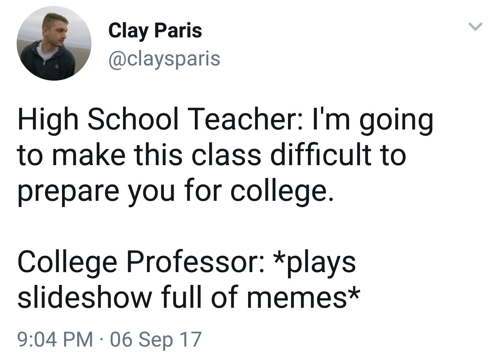

# Notes and Overview for Week 8

[ENGL 5362, Fall 2023](/5362/calendar.html)

## Agenda
1. compose thyself
1. Questions re the [Digital project](5362/project-3)
2. Followup questions from Part II of *Update Culture*: Timing, Attention, Management?
3. Starting in on *Circulation as an Emergent Threshold Concept*
4. Volunteers for next set of talking points, Oct. 26

*Assigned readings can always be found on Blackboard. Addional resources should be there, and if not are accessible through our Library)*

## Notes and Questions for *CWR* (Intro, by laurie Gries)

### Your questions and talking points
1. Volunteers created the following talking points:
    - [Dylan's talking points](media/talking-points-dylan.docx)
    - [Sandra's talking points](media/talking-points-sandra.pdf)
    - [Shane's talking points](media/talking-points-shane.docx)

### Introduction: Circulation as an Emergent Threshold Concept
- spatiotemporal flow
- cultural-rhetorical process
- dynamic, ubiquitous flow of discourse, ideas, information, etc. (p. 5); a "focus on how bodies, artifacts, words, pictures, and other things flow within and across cultures to affect meaningful change" (p. 7)
- "rhetorical theory has always been preidcated on the circulation of ideas, feelings, and mores" (p.3) (doxa, delivery, commonplaces)

If you're going to study circulation, what broad questions are you working with, and what more specific questions might you or do you need to ask? 
    - how do things (people, ideas, images, and discourse) become persuasive as they move through the world and enter into various associations? 
    - dynamic dimensions of rhetoric--how is rhetoric a distributed event that unfolds with time in and across neetworks of emergent relations?
    - affective dimensions of rhetoric--how does rhetoric become 'contagious' as is moves individual/collective bodies in both conscious and unconscious ways?
    - new materialist dimensions of rhetoric--how do things become agentive and vital as they engage in various activities? 

How do we distinguish between distribution and circulation? 

How does circulation come into play throughout your writing process--from invention to revision to distribution? 

Think of a collaboration--how can we analyze the circulation of information in that process? What does analyzing/understanding circulation help you do in that context? 

### Memes and circulation
Le's talk about memes:

1. Compile 3 to 5 of your current favorite memes and post them to the "memeblog" in Blackboard. Post what you want--it can be as niche or broad as you want. Remember it's a class and we're people.
2. Browse through others' memes, look at them and familiarize yourself with them.
3. Discussion questions:
    - Which are your favorites, and why?
    - Did you find any new memes you like and didn’t expect?
    - Are there any you don’t like, and why not?
4. More questions:
    - what kinds of technological and access needs must be met to make a meme?
    - what kinds of rhetorical tools do memers need? 

- [Memetic Rhetorics: Toward a Toolkit for Ethical Meming](https://www.fulcrum.org/concern/monographs/x633f368k), by Derek Sparby
    - "memes are never solitary items but are instead a collection of texts that rely on other cultural artifacts as well as direct action from users to gain memetic success" (p. 48)
- [https://imgflip.com/memegenerator](https://imgflip.com/memegenerator)
- [https://knowyourmeme.com/](https://knowyourmeme.com/)

What are the rhetorical tools necessary to create successful memes? Sparby posits eight components in a memetic rhetoric toolkit:
1. Possessing the *functional digital skills* for creating memes
2. Using *irony and hyperirony* for humor
3. Understanding *identification* and how to make content resonate with viewers
4. Understanding *kairos* and how to capitalize on memetic moments
5. Recognizing *intertextuality* and building it into memetic content
6. Knowing how to *remix* texts so that they are recognizable as iterations of previous memes
7. Strategizing how to use the *social media platform* to advance memetic goals
8. Engaging in *rhetorical velocity* to think about further iterations and versions of memetic content.

## For Next Time (for Oct 26 )

For the next three weeks we're working together through Gries & Brooke (Eds.) (2018). *Circulation, Writing, and Rhetoric*. [https://www.jstor.org/stable/j.ctt21668mb](https://www.jstor.org/stable/j.ctt21668mb) You will read selectively, rather than the entire book, and between all of us, we will be able to have multiple readings of the core issues in the text. 

Everyone will prepare talking points and post them for your reading journal entry that week, either as a Word doc or pdf file attached to your journal entry. I will invite three volunteers to help lead discussion by working through their talking points with the class. 

- <mark>Pick 1 outside reading that's relevant to the concept of Circulation (could be from your annotated bib, or could be a new find) to read and prepare talking points</mark>
- <mark>Select any 1 "response" chapter from part 2 of the book to read and prepare talking points:</mark>
    - Circulation Exhaustion, by Jenny Rice. p. 281
    - Archival Problems, Circulation Solutions, by Jessica Enoch, P. 289
    - Circulation-Signification-Ontology, by Thomas Rickert, p. 300
    - A Diagrammatics of Persuasion, by Byron Hawk, p. 308
    - The Spaces Between, by Sidney Dobrin, p. 315

