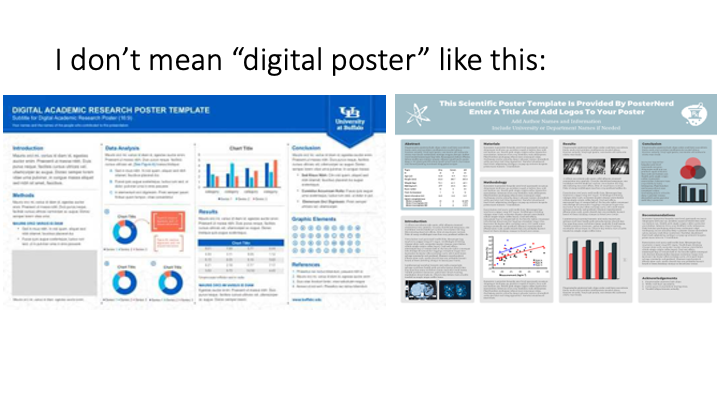
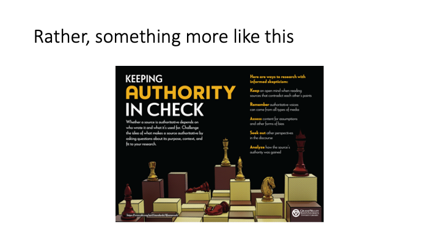
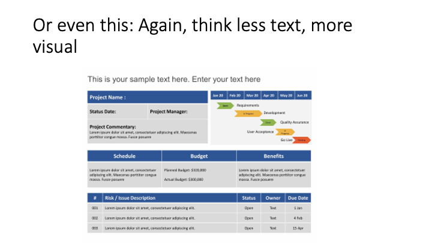

# Overview for Week 14

[ENGL 5362, Fall 2023](/5362/calendar.html)

Hi, all. I hope you had good Thanksgivings all around! It's home stretch time!

# Team-up Supaclass

Thursday, November 30 at 7:00 pm we will be meeting online via Zoom, not on campus.

This is a special cross-class meeting, and we will be joining together with students from Dr. Fitzsimmons-Doolan's Online Learning course. She and I have cooked up an activity that you and her folks will all will work through together. This activity will be summative in nature; we're going to look for connections and divergences in the contents of the two different classes. 

To help you pre-game a bit, I suggest reviewing the syllabus and taking a walk through your notes--what are the major topics, questions, theoretical concepts, and so forth that you have learned about and studied in this course? (Frankly, this will help you with reflecting on and preparing for your online presence project presentations, too!).

Zoom link: https://tamucc.zoom.us/j/7887225921?pwd=dzZxTW1WS1ZBV1VZclVDNFVraEExZz09

After our shared activity (which will take about an hour and a half), we'll have some time and space for questions about the last week of class

## For next time: Meet <mark>Tuesday</mark>, December 5th 7pm in CCH

1. **Read and prepare to discuss Bradshaw (2020), "Rhetorical Exhaustion & the Ethics of Amplification"** (our last discussion!) This will let us sum up some conversations we've been having about audience, reception, and rhetorical exhaustion. This article is in our readings folders. 

2. **Online Presence Presentations (!)** These presentations are the "tell us the results of your learning" as you've gone through the ups and downs of your semester-long online presence writing activity. 

In this project, you were asked to "Produce, distribute, circulate, and manage an ongoing online writing presence throughout the course of the semester; progress should be made each week. This assignment is designed for you to write on a consistent basis beyond the confines of the classroom and encourage you to enact or engage with the theories and concepts we’re studying in the course. You will present the results of your learning at the end of the semester to the class."

(Also, don't forget to turn in your log of your "Twenty indivudal acts of composition" to Blackboard)

On December 5th, you'll give that presntation. Constraints:
- 1 single PowerPoint slide, used as a poster rather than a traditional PPT slide with bullet points and a headline. Keep text minimal and legible--slides will be displayed on the display screen in ourc classroom.
- Show/discuss your semester experiences, what you learned about writing online, and why you will or will not continue it. Look for explicit connections you might make to topics and authors we've worked with in the course. 
- Talking points (you don't need to turn these in) to keep you talking for 4-5 minutes with time for Questions & Answer

On posters. Think "one slide presentation" not "shove all the words in one slide omg omg omg"

