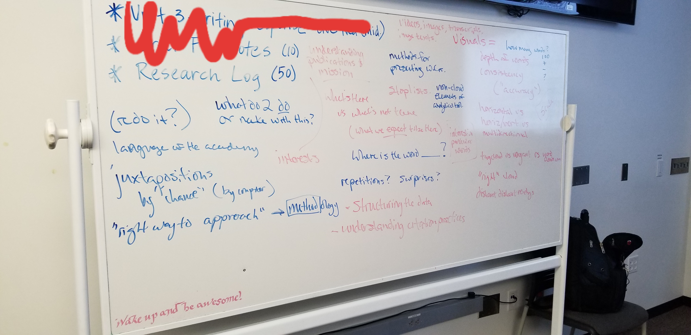
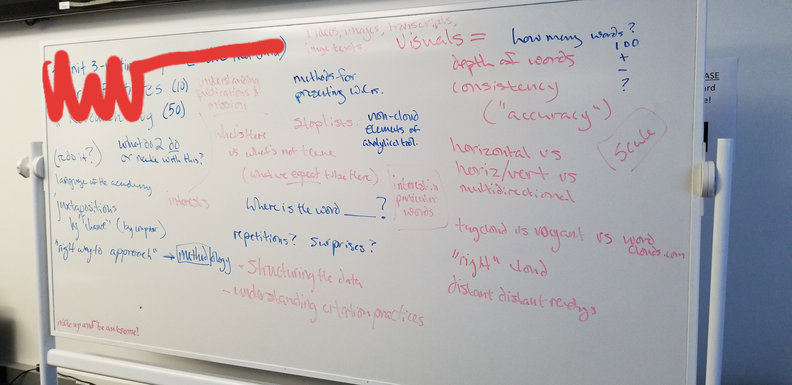

# praxis idea:

What sort of thing can I make with my students that works with their distant readings (word clouds)? What do they do, and what is the publication?

I suppose it's kind of testing the assertion (especially by Mueller), though I like fiddling and playing (engaging in a rhetorical ecology especially an expansion of proairesis) that word clouds are a good form of novice-centric word-watching, useful for graduate students entering the field to get a kind of loose "network sense" that could be followed up with other activities.

This doesn't mean we'd be truly testing that assertion as research, but certainly putting that assertion to the test.

Is such a webtext (of course a webtext) a reflection on a "method" and methodological reenactment? What is it we're understanding here?

Digital rhetoric's digital rhetoric (the problem of introducing a field to students who didn't even know the field's a field or if they did didn't have much sense of what it meant (rhetoric, much less digital rhetoric, being alien space and time.)) Rhetorical ecology stuff--lots of Brooke and Mueller.

I see a text that puts together (clean) versions of the class' word clouds, inviting reflection and generative (proairetic) perspective on pattern-delivering. Thus reading digital rhetoric via digital rhetoric (de Brooke and Eyman and others). Create a hypertextual reflection that describes and assesses what we see, what we read, how we follow up on it, and how we did it. Include some instructor reflectheorizing. Galleries (?) of word clouds and superclouds at various levels of scalability. And inviting the sorts of questioning that we can do with that kind of information.

Do we include other journals? Where do we stop? How do we ensure "method" to our madness? I think this is what I want to work on with my students for the next X weeks. We could drop the rhetorical analysis for the most part and just work on this and maybe only the parts of the nannotated bibliography that are relevant to this project (i.e. comparing the article dips to the cloud scans) for the rest of the semester and I'd be happy. Would they? Of course working through a multimodal production would be interesting.

Have to map out the work over seven weeks. Need lit review, collection, noticing, archiving, etc.

Need standard text files to analyze, probably a collaborative zotero doc for bibliographic noticing.

