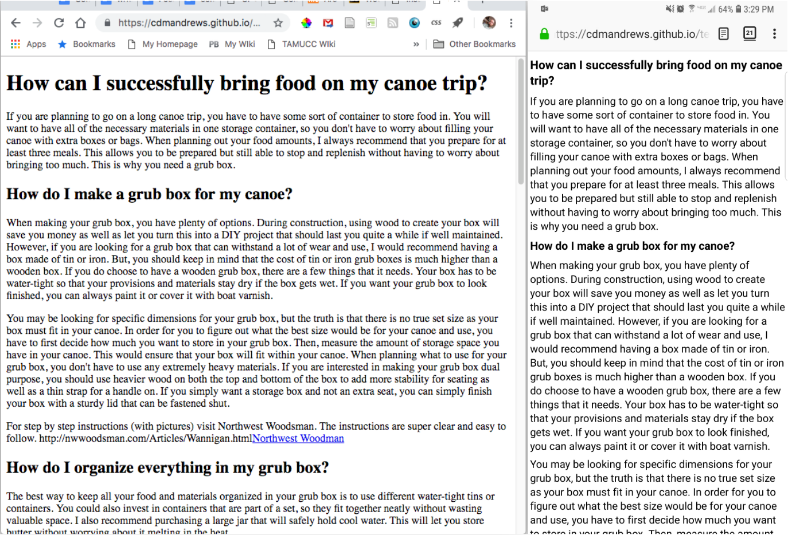
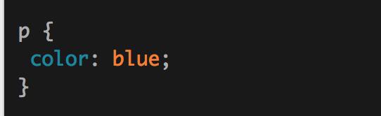
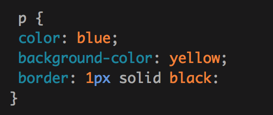

# "Handout" for Week 7

[ENGL 5369, Fall 2019](calendar.html)

[Slides if you want such things](https://docs.google.com/presentation/d/e/2PACX-1vRufA94YIvpbFkJ2K591QOVPqCeLM5nAcGgkbJ0uiCuOgYeWh5OUR1FXmLTWgReyHFb8yPoLY4kWyb5/pub?start=false&loop=false&delayms=3000)

[Everyone's sites so far](fambly)

[week 7 notes](week-07-notes.html)

## Praxis: Distant reading

First, we should check out and discuss your wordclouds.
- [Carolina's *Hybrid Pedagogy* wordclouds](https://carolinaavsar.github.io/wordclouds.html)
- [Elizabeth's *Present Tense* wordclouds](https://emock1.github.io/distant-reading.html)
- [Emille's *XChanges* wordclouds](https://emireno.github.io/drproject.html)
- [Ethan's *DHQ* wordclouds](https://ethanlgross.github.io/distant-reading-dhq.html)
- [Kelsy's *Peitho* wordclouds](https://kelsymascorro.github.io/)
- [Nicole's *C&C* wordclouds](https://hellonicoler.github.io/portfolio/distant-reading/index.html)
- [Philly's *Technoculture* wordclouds](https://phillyvasquez.com/wordclouds.html)
- [Sydney's *Enculturation* wordclouds](https://sydneyspangler.github.io/distant-reading-project/)

Let's take some time and do some "noticing" in everyone's clouds.

- What do you see/notice?
- What questions emerge?
- What are the keyest key terms circulating across all of these?
- What is our distant reading's account of these texts?
- What sort of knowledge do we need to make use of these clouds?
- What kind of systematic data coding (and preparation) would we need to do to make better use of our initial distant reading?
- What happens (does/can anything happen) when we place these alongside Eyman's discussion of the "primary activities in the field of digital rhetoric"?
  - the use of rhetorical strategies in production and analysis of digital texts
  - identifying characteristics, affordances, and constraints of new media
  - formation of digital identities
  - potential for building social communities (first four from Zappen, 2005, p. 319)
  - inquiry and development of rhetorics of technology
  - the use of rhetorical methods for uncovering and interrogating ideologies and cultural formation in digital work
  - an examination of the rhetorical function of networks
  - theorization of agency when interlocutors are as likely to be software agents (or “spimes”) as they are human actors (full list from Eyman, 2015, ch 1.)

Worth looking at:
- Palmeri & McCorkle 2017, "Distant view of EJ" [link](http://technorhetoric.net/22.2/topoi/palmeri-mccorkle/)
- Mueller 2012, "Views from a distance" [link](http://kairos.technorhetoric.net/16.2/topoi/mueller/)

## Praxis: CSS in the HTML and drink em bot' up.

1. Create an empty text file in your main HTML directory named `style.css` (you can name it anything you like).
2. To link the CSS file to your HTML files, add the following line of markup in the `head` element of each of your HTML files:  

 `<link href="style.css" rel="stylesheet" type="text/css">`

3. Don't forget to remove the old stylesheet link from your index.html if it's still there.

### How CSS works

As you read in Stolley, **Cascading Style Sheets (CSS)** is a plain text file format used for formatting content marked up in HTML.

Your browser already uses a default stylesheet to define how it displays  HTML markup. For example, in Firefox on my laptop, basic HTML pages are displayed in Times New Roman, while in Firefox on my Samsung Note, pages display in my device's default sans serif typeface. Spacing, margins, and text sizes are all set in this stylesheet as well.

  <figure style="margin: 1em; max-width: 75%;">
    <figcaption style="padding: .3em; color: #6a737d; font-style: italic;">Comparison of the same HTML page with default styles on different devices.</figcaption>
    </figure>

CSS gives your browser rules that affect how linked HTML documents should be displayed. CSS rules are formed from:
  <ul>
    <li><strong>properties</strong>, which have <strong>values</strong> to update how HTML content is displayed</li>
    <li><strong>selectors</strong>, which select which elements to apply those properties to. Selectors allow you to target all elements of a certain type.</li>
  </ul>
  
A CSS rule looks like this:

  <figure style="margin: 1em; max-width: 75%;">
    <figcaption style="padding: .3em; color: #6a737d; font-style: italic;">A CSS rule with a single selector and a single declaration. The selector is <code>p</code>, the property is <code>color</code>, and the value is <code>blue</code>.</figcaption>
  </figure>

In the example above, the rule begins with the p selector; it will apply property values (called a **declaration**) to all paragraph elements on the HTML page. In this case, the declaration sets the paragraph text color to blue. The property and value of a CSS declaration are separated by a colon. A declaration is separated from the next declaration with a semicolon. Notice that some declarations can include multiple values. For example:

  <figure style="margin: 1em; max-width: 75%;">
      <figcaption style="padding: .3em; color: #6a737d; font-style: italic;">A CSS rule with a single selector and multiple declarations.</figcaption>
    </figure>

#### A comment on comments

CSS comments use the format `/* This is a comment in CSS */` Use CSS comments to keep track of those tricky decisions, calculations, and other notes (especially as you're learning) that will help you understand what you were trying to do and why.

CSS files don't have a bunch of rules for structure; they're simply lists of rules, applied in order from beginning to end. Many developers will use comments to create sections and organize their stylesheets for themselves and other users. See [my stylesheet](https://cdmandrews.github.io/css/style.css) for examples.

### Links and things for css

- [the box model](https://developer.mozilla.org/en-US/docs/Learn/CSS/Building_blocks/The_box_model)
- To clear all default styles, add [Eric Meyer's CSS Reset styles](https://meyerweb.com/eric/tools/css/reset/) to the top of your `.css` file.
- **exhaustive** [CSS Reference](https://developer.mozilla.org/en-US/docs/Web/CSS/Reference)

## Theoria

- Brooke 4
- Brooke 5
- Brooke 6

## Word Cloud things

Mueller, Derek. (2012b). Views from a distance: A nephrological model of the CCCC chairs' addresses, 1977-2011. Kairos: A Journal of Rhetoric, Technology, and Pedagogy, 16(2). Retrieved July 31, 2016, from [http://kairos.technorhetoric.net/16.2/topoi/mueller/](http://kairos.technorhetoric.net/16.2/topoi/mueller/):

> Indeed, like maps, clouds are more than neutral descriptions; they are constructs with properties that deliberately bring forward selected qualities of texts while downplaying others. (p. 2

> Subject to distant reading methods the addresses disappear and are replaced by substitutive, or tropical abstractions: a series of word clouds, in this case. Paradoxically, the addresses resurface in a severely abridged light as they are simultaneously remade, staged again, and resent into circulation (agitated, delivered).

> The visibility of such patterns yields related openings for inquiry and speculation: Can we imagine a primarily light-hued cloud in years to come? Or an address to the field absent such constants as students, writing, composition, college, university, or literacy? I raise these questions cautiously aware that they may appear critical of convention; however, I am foremost interested in pointing out that heuristic openings created by the clouds are as important as the report they offer on the culture of CCCC. That is, I maintain that the model's conceptual counterpart, network sense, functions both as a perspective on the culture of the organization and a catalyst for action concerning the shape of the field to come. (p. 2)

> As a type of distant reading, word clouds turn to data-mining processes to draw the most frequently used terms from full-text versions of the addresses. A radical reduction occurs in this meronymous amalgamation. Selected parts stand out from the thick, ecologically entangled whole. Yet this reduction is only temporary: The clouds elicit wonder or memory encounters without urging permanent annihilation of the full text. These, like all word clouds, yield a heuristic if in looking at them we find provocations to tease and shape further inquiry. (p. 5)

Mehta, Chirag. (2007). US presidential speeches tag cloud. Retrieved from [http://chir.ag/projects/preztags/](http://chir.ag/projects/preztags/)

Palmeri, Jason, & McCorkle, Ben. (2017). A distant view of English Journal, 1912-2012. Kairos: A Journal of Rhetoric, Technology, and Pedagogy 22(2). Retrieved September 25, 2019, from [http:/​/​kairos.technorhetoric.net/​22.2/​topoi/​palmeri-mccorkle/​index.html](http://technorhetoric.net/22.2/topoi/palmeri-mccorkle/index.html)

## What to do for Week 08:
 1. Review Stolley chapters 17 & 18 & continue working on styles
 2. Read Brooke chapters 7-8
 3. Read Porter, Ridolfo & DeVoss, Lambke (all liked on [calendar](calendar.html))
