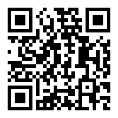

# Tutoring Technical Writing Workshop  
A workshop for CASA Writing Center @ TAMUCC
October 25, 2019

## First principles:
Tutoring Engineering and Technical Writing is the same as tutoring everything else. Tutors should:
1. read and assess based on rhetorical concepts: audience, purpose, context
2. have a grasp of grammatical rules and myths
3. be able to interact in a comfortable, non-hierarchical manner with writers
4. be positive and ask effective questions
5. recognize the difference between helping and editing; directive and non-directive tutoring
  - "Tables help readers comprehend large data sets" vs "Include a table in this section."
6. effectively distinguish between HOCs and LOCs
7. do it all in half an hour the day before the thing is due

<iframe src="https://docs.google.com/presentation/d/e/2PACX-1vQfuAIR3yyl0sVd0jp9lUnu6I8DhVsJuYxnttm_GPQW2Uqt0hrn3flszOJXhiEEmNrBLWRmfgnS7eOE/embed?start=false&loop=false&delayms=3000" frameborder="0" width="960" height="569" allowfullscreen="true" mozallowfullscreen="true" webkitallowfullscreen="true"></iframe>

## Sample technical reports/studies

["A 3D Printer for Interactive Electromagnetic Devices"  (ACM, via Disney Research)](https://s3-us-west-1.amazonaws.com/disneyresearch/wp-content/uploads/20161011233026/A-3D-Printer-for-Interactive-Electromagnetic-Devices-Paper.pdf)

["Portable Laser Guided Robotic Metrology System" (NASA Technical reports Server)](https://ntrs.nasa.gov/archive/nasa/casi.ntrs.nasa.gov/20190032027.pdf)

["Sabine Pass to Galveston Bay, TX Coastal Storm Risk Management and Ecosystem Restoration"(Environmental Impact Statement & Feasability report, US Army Corps of Engineers)](https://drive.google.com/open?id=1z5Akqx2BL0eC8_OlqhcR4CRyK3_vgJU2)

[Geotechnical engineering study (Raba Kistner Consultants; do not reproduce)]()

[Buying a used Shopsmith (User-created guide)](files/engr/shopsmith-guide.pdf) Caution: Not especially effective in assisting readers locate information or quickly understand illustrations/text relationships, etc.

[Lab report 1](files/engr/lab-report-example1.pdf)

[Lab report 2](files/engr/lab-report-example2.pdf)

## Resources

[Reverse Paramedic Method](https://owl.purdue.edu/owl/general_writing/academic_writing/reverse_paramedic_method.html)  
Editing exercise emphasizing concision while remaining in the passive voice.

[Writing Lessons for Engineering and Science](https://www.craftofscientificwriting.com/) by Michael Alley.   
Variety of resources and slideshows, geared more towards instructors but useful to the technical and scientific writer.
